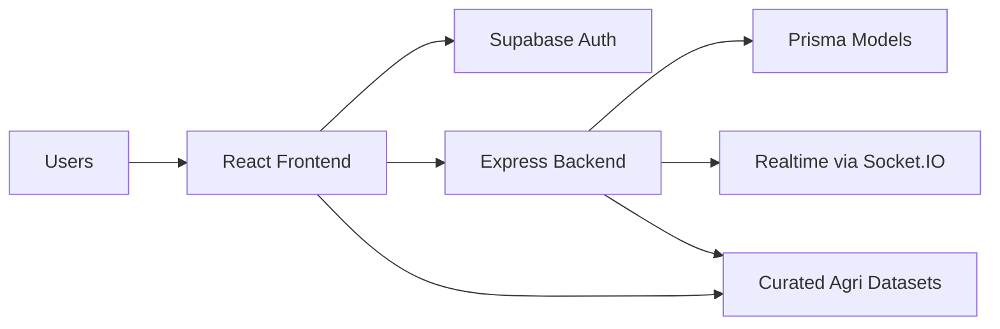

# Farm Intellect / Smart Crop Advisory

Farm Intellect is a multi-role agricultural advisory platform built for farmers, experts, merchants, and administrators. It combines authenticated dashboards, AI-assisted workflows, curated agricultural datasets, analytics, weather intelligence, crop planning tools, and community collaboration features into a single full-stack application.

## What the project solves

Farmers often need to jump across multiple tools to answer everyday decisions:

- What crop should I grow in this soil and season?
- Is this leaf symptom a disease or a pest problem?
- What is the mandi price trend for my commodity?
- When should I sow, irrigate, fertilize, or harvest?
- Which schemes, experts, and advisory channels are relevant to me?

This project brings those workflows into one role-aware platform.

## Core capabilities

- **Role-based access** for farmers, experts, merchants, and admins
- **AI chatbot** powered by curated Kisan Call Centre and crop disease knowledge
- **AI crop scanner** backed by disease and pest datasets
- **Crop recommendation engine** based on soil parameters and seasonal context
- **Crop calendar** using ICAR-CRIDA advisory schedules
- **Weather and market intelligence** with OpenWeatherMap + mandi data
- **Analytics dashboards** with crop production and MSP/mandi insights
- **Field map and vegetation guidance** using satellite thresholds and NDVI stage profiles
- **Forum, documents, notifications, and chat** for community and operational workflows

## Tech stack

### Frontend

- React 18
- Vite 5
- TypeScript
- Tailwind CSS
- shadcn/ui + Radix UI
- React Router
- TanStack Query
- Recharts

### Backend

- Node.js + Express
- Prisma ORM
- SQLite (default local backend DB)
- Socket.IO
- Winston logging
- Express Validator
- Multer uploads

### Platform services

- Supabase Auth + profile/role tables
- Vercel deployment for SPA frontend
- OpenWeatherMap API

## Project structure

```text
farm-intellect-65/
├── src/                  # React frontend
├── backend/              # Express + Prisma backend
├── supabase/             # Supabase config and functions
├── docs/                 # Architecture, API, security, data, deployment docs
├── public/               # PWA/static assets
└── .github/workflows/    # CI pipeline
```

## Main user roles

- **Farmer**: crop planning, disease scanning, weather, schemes, merchants, advisory
- **Expert**: AI advisory, scan review, chat, expert notifications
- **Merchant**: farmer connections, market prices, merchant docs and alerts
- **Admin**: users, analytics, settings, moderation, notifications

## Architecture at a glance



Full diagrams live in [`docs/architecture.md`](docs/architecture.md).

## Dataset-backed modules

The project includes curated agricultural knowledge modules with documented sources:

- crop diseases
- pests and IPM
- crop recommendations
- crop production analytics
- mandi prices and MSP
- Kisan Call Centre Q&A
- soil health references
- satellite vegetation thresholds
- crop calendars

See [`docs/datasets.md`](docs/datasets.md) for citations and provenance.

## Local setup

### Frontend

```bash
npm install
npm run dev
```

### Backend

```bash
cd backend
npm install
npm run dev
```

### Required environment variables

Create `.env` from `.env.example` and provide values for:

- `VITE_SUPABASE_URL`
- `VITE_SUPABASE_PUBLISHABLE_KEY`
- `VITE_SUPABASE_PROJECT_ID`
- `VITE_OWM_API_KEY`

Backend environment variables are documented in [`docs/deployment.md`](docs/deployment.md).

## Quality and automation

- Frontend tests: `npm run test`
- Backend tests: `cd backend && npm run test`
- Frontend lint: `npm run lint`
- CI workflow: `.github/workflows/ci.yml`

See [`docs/testing.md`](docs/testing.md).

## Security snapshot

Recent hardening included:

- removal of hardcoded weather key from source
- OTP bypass cleanup in login flows
- Socket.IO JWT validation
- Supabase edge function JWT verification enabled
- route-specific backend rate limiting
- stricter RBAC middleware usage on sensitive routes

See [`docs/security.md`](docs/security.md).

## Documentation index

- [`docs/architecture.md`](docs/architecture.md)
- [`docs/system-design.md`](docs/system-design.md)
- [`docs/app-structure.md`](docs/app-structure.md)
- [`docs/service-boundaries.md`](docs/service-boundaries.md)
- [`docs/database.md`](docs/database.md)
- [`docs/api.md`](docs/api.md)
- [`docs/deployment.md`](docs/deployment.md)
- [`docs/security.md`](docs/security.md)
- [`docs/datasets.md`](docs/datasets.md)
- [`docs/flow-images.md`](docs/flow-images.md)
- [`docs/slide-diagram-assets.md`](docs/slide-diagram-assets.md)
- [`docs/viva-script.md`](docs/viva-script.md)
- [`docs/future-capabilities.md`](docs/future-capabilities.md)
- [`docs/testing.md`](docs/testing.md)
- [`docs/user-flows.md`](docs/user-flows.md)
- [`docs/roadmap.md`](docs/roadmap.md)
- [`docs/demo-assets.md`](docs/demo-assets.md)
- [`docs/project-assessment.md`](docs/project-assessment.md)

## Demo media

The repository now includes a demo asset manifest and screenshot/GIF plan in [`docs/demo-assets.md`](docs/demo-assets.md). Actual screenshots/GIF binaries still need to be captured manually from a running app environment.

## Current maturity

- **Feature maturity:** strong
- **Architecture maturity:** strong
- **Documentation maturity:** now substantially improved
- **Production maturity:** moderate; additional monitoring, validation rollout, and service hardening recommended

## License / usage note

This repository contains curated public-reference agricultural data and should retain source attribution when reused.

