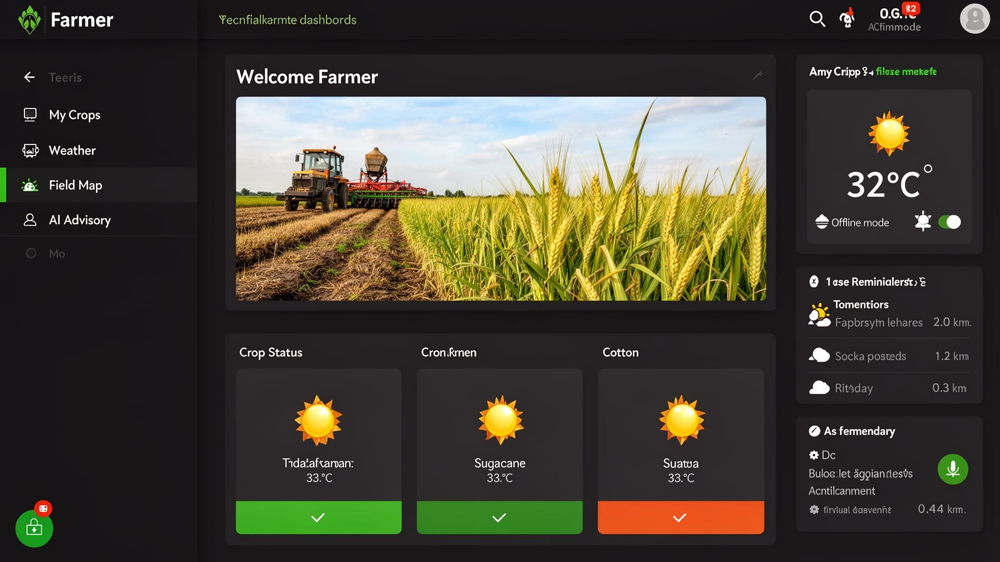
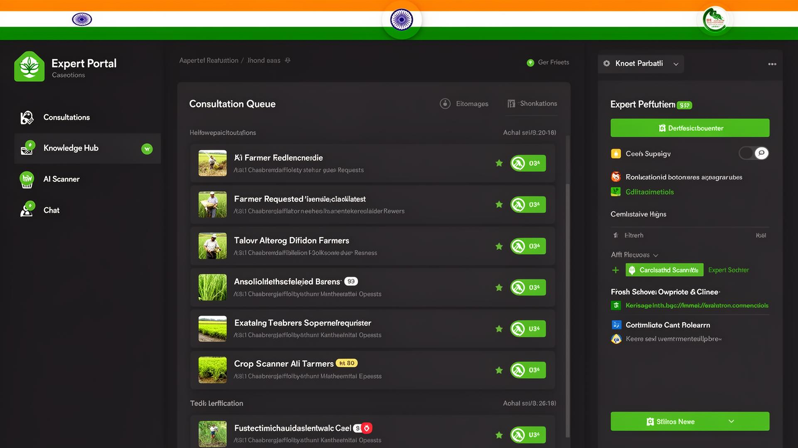
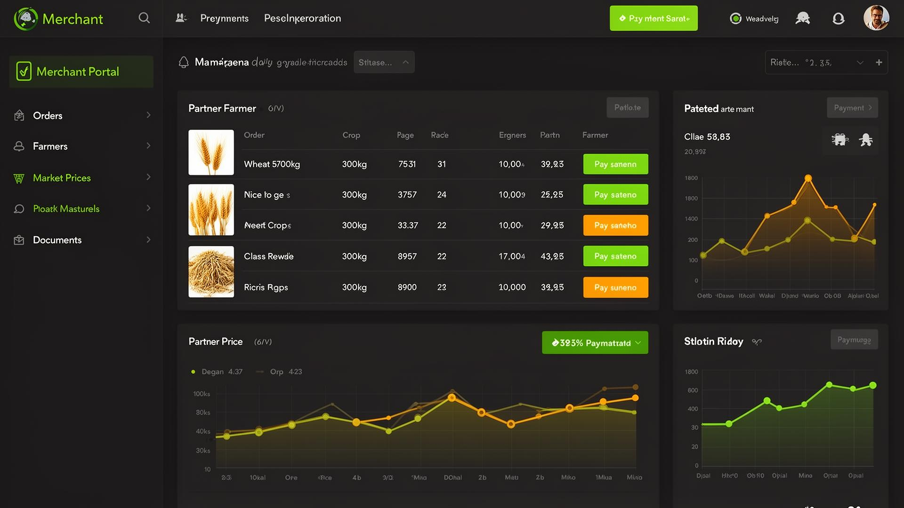
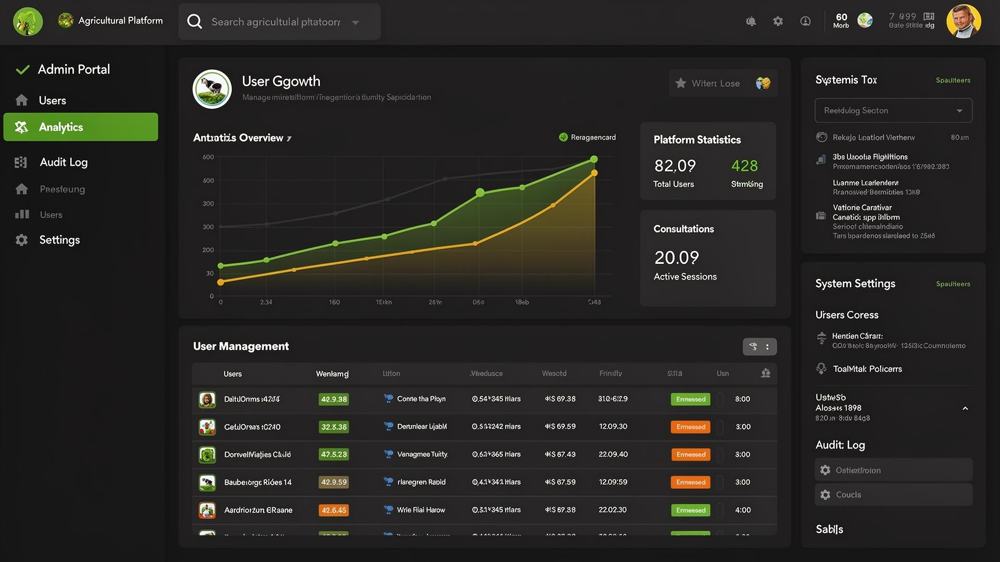
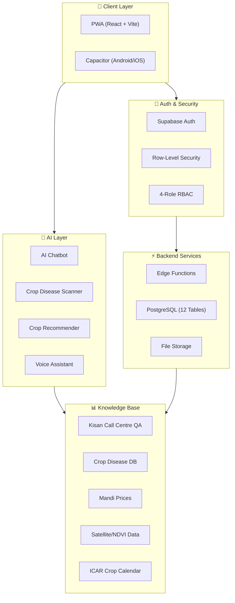
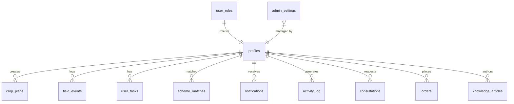

<p align="center">
  
</p>

<h1 align="center">🌾 Krishi AI — Farm Intellect</h1>

<p align="center">
  <strong>AI-Powered Smart Agriculture Platform for Indian Farmers</strong>
</p>

<p align="center">
  <a href="https://farming-gamma.vercel.app/"></a>
  
  
  
  
  
</p>

<p align="center">
  
  
  
  
</p>

---

## 📸 Screenshots

<details>
<summary><strong>🧑‍🌾 Farmer Dashboard</strong> — Crop status, weather, offline mode, scheme matcher</summary>
<br/>

</details>

<details>
<summary><strong>👨‍🔬 Expert Dashboard</strong> — Consultation queue, knowledge hub, AI scanner</summary>
<br/>

</details>

<details>
<summary><strong>🏪 Merchant Dashboard</strong> — Orders, partner farmers, market price charts</summary>
<br/>

</details>

<details>
<summary><strong>🔧 Admin Dashboard</strong> — Analytics, user management, audit logs, settings</summary>
<br/>

</details>

---


- [🎯 Problem Statement](#-problem-statement)
- [✨ Key Features](#-key-features)
- [🏗️ Architecture](#️-architecture)
- [👥 User Roles](#-user-roles)
- [🛠️ Tech Stack](#️-tech-stack)
- [📁 Project Structure](#-project-structure)
- [🚀 Getting Started](#-getting-started)
- [📱 Mobile App (APK/IPA)](#-mobile-app-apkipa)
- [🌐 PWA Installation](#-pwa-installation)
- [🗄️ Database Schema](#️-database-schema)
- [🤖 AI Capabilities](#-ai-capabilities)
- [📊 Datasets & Knowledge Base](#-datasets--knowledge-base)
- [🔒 Security](#-security)
- [🧪 Testing](#-testing)
- [🚢 Deployment](#-deployment)
- [📖 Documentation Index](#-documentation-index)
- [🗺️ Roadmap](#️-roadmap)
- [📄 License](#-license)

---

## 🎯 Problem Statement

Indian farmers juggle **multiple disconnected tools** for everyday decisions:

| Challenge | Current Pain Point |
|---|---|
| 🌱 What crop to grow? | No soil + season + market integrated recommendation |
| 🦠 Is this a disease? | No instant AI-powered crop disease scanner |
| 💰 What's the mandi price? | Scattered price data across portals |
| 📅 When to sow/irrigate/harvest? | No personalized crop calendar |
| 📋 Which govt schemes apply to me? | Complex eligibility across 100+ schemes |
| 🗣️ Language barrier | Most tools are English-only |

**Krishi AI** solves this by unifying all agricultural workflows into **one role-aware, multilingual, offline-capable platform**.

---

## ✨ Key Features

### 🧑‍🌾 For Farmers
- **AI Crop Recommendation Engine** — Soil + season + region-based suggestions
- **AI Crop Disease Scanner** — Upload leaf photo, get instant diagnosis
- **Smart Chatbot** — Powered by Kisan Call Centre knowledge base
- **Personalized Crop Calendar** — ICAR-CRIDA advisory schedules
- **Government Scheme Matcher** — Eligibility wizard for PM-KISAN, PMFBY, etc.
- **Weather Intelligence** — Real-time weather with farming advisories
- **Mandi Price Tracker** — Live market prices with trends
- **Digital Farm Diary** — Field history, irrigation logs, harvest records
- **Voice Assistant** — Multilingual voice input/output

### 👨‍🔬 For Agricultural Experts
- **Consultation Queue** — Manage farmer queries with priority triage
- **Knowledge Hub** — Publish articles, guides, and best practices (full CRUD)
- **AI Advisory Tools** — Enhanced AI tools for expert-level analysis
- **Expert Chat** — Direct communication with farmers

### 🏪 For Merchants
- **Order Management** — Track crop orders with payment status
- **Farmer Network** — Connect with local farmers
- **Market Price Analytics** — Price trends and predictions
- **Document Management** — Invoices, contracts, certifications

### 🔧 For Administrators
- **User Management** — RBAC with role assignment
- **Analytics Dashboard** — Platform-wide metrics and insights
- **Audit Logs** — Complete activity trail
- **System Settings** — Configurable platform settings (persisted to DB)

### 🌍 Platform-Wide
- **22 Languages** — Hindi, Punjabi, Tamil, Telugu, Bengali, Marathi, Gujarati, Kannada, Malayalam, Odia, Assamese, Urdu, and more
- **Offline Mode** — IndexedDB caching with service worker
- **Dark/Light Theme** — Fully themed with Indian tricolor accents
- **PWA + Native App** — Install from browser OR build APK/IPA

---

## 🏗️ Architecture



---

## 👥 User Roles

| Role | Dashboard | Key Capabilities |
|---|---|---|
| 🧑‍🌾 **Farmer** | Crop status, weather, tasks, AI chat | Full farming toolkit, scheme matcher, field diary |
| 👨‍🔬 **Expert** | Consultation queue, knowledge hub | Publish articles, resolve farmer queries, AI tools |
| 🏪 **Merchant** | Orders, farmer network, prices | Order CRUD, market analytics, documents |
| 🔧 **Admin** | Platform analytics, user mgmt | Role assignment, audit logs, settings |

> Roles stored in dedicated `user_roles` table with `app_role` enum — **never on profiles** (prevents privilege escalation).

---

## 🛠️ Tech Stack

### Frontend
| Technology | Purpose |
|---|---|
| **React 18** | UI framework |
| **TypeScript 5** | Type safety |
| **Vite 5** | Build tool & dev server |
| **Tailwind CSS** | Utility-first styling |
| **shadcn/ui + Radix** | Component library |
| **React Router 6** | Client-side routing |
| **TanStack Query** | Server state management |
| **Framer Motion** | Animations |
| **Recharts** | Data visualization |
| **Capacitor** | Native mobile (Android/iOS) |

### Backend
| Technology | Purpose |
|---|---|
| **Supabase** | Auth, PostgreSQL, Edge Functions, Storage |
| **Row-Level Security** | Data access control |
| **Edge Functions (Deno)** | Serverless API (weather, chat, market) |
| **IndexedDB** | Offline data caching |

### Infrastructure
| Technology | Purpose |
|---|---|
| **Vercel** | Frontend hosting (SPA) |
| **PWA + Service Worker** | Offline support & installability |
| **GitHub Actions** | CI/CD pipeline |

---

## 📁 Project Structure

```
krishi-ai/
├── 📂 src/
│   ├── 📂 components/
│   │   ├── ai/              # AI chatbot, crop scanner, voice query
│   │   ├── analytics/       # Charts, yield predictor
│   │   ├── auth/            # Profile setup, login flows
│   │   ├── calendar/        # Crop calendar, planner
│   │   ├── chat/            # AI chatbot variants
│   │   ├── consultations/   # Farmer-expert consultations
│   │   ├── crops/           # Seasonal crop guide
│   │   ├── dashboard/       # Role dashboards, widgets
│   │   ├── documents/       # Document upload
│   │   ├── features/        # 15+ advanced feature modules
│   │   ├── forum/           # Community forum
│   │   ├── home/            # Landing page hero, animations
│   │   ├── layout/          # Header, sidebar, page transitions
│   │   ├── notifications/   # Notification center
│   │   ├── pwa/             # Install prompt
│   │   └── ui/              # 50+ shadcn/ui components
│   ├── 📂 contexts/         # Auth, Language providers
│   ├── 📂 data/             # 10+ curated agri datasets
│   ├── 📂 hooks/            # Custom React hooks
│   ├── 📂 i18n/             # 22-language translations
│   ├── 📂 lib/              # Utils, API, offline cache
│   ├── 📂 pages/            # 30+ route pages
│   │   ├── admin/           # Admin sub-pages
│   │   ├── expert/          # Expert sub-pages
│   │   └── merchant/        # Merchant sub-pages
│   └── 📂 types/            # TypeScript types
├── 📂 supabase/
│   ├── config.toml          # Supabase configuration
│   ├── 📂 functions/        # Edge functions (chat, weather, market)
│   └── 📂 migrations/       # Database migrations
├── 📂 public/
│   ├── 📂 icons/            # PWA icons (192x192, 512x512)
│   ├── sw.js                # Service worker
│   ├── manifest.json        # PWA manifest
│   └── 📂 audio/            # Ambient sounds
├── 📂 docs/                 # 20+ documentation files
├── capacitor.config.ts      # Native mobile config
├── vercel.json              # Vercel deployment config
└── .github/workflows/       # CI pipeline
```

---

## 🚀 Getting Started

### Prerequisites
- Node.js 18+
- npm or bun

### Installation

```bash
# Clone the repository
git clone https://github.com/your-username/farm-intellect-65.git
cd farm-intellect-65

# Install dependencies
npm install

# Start development server
npm run dev
```

### Environment Variables

Create `.env` from `.env.example`:

```env
VITE_SUPABASE_URL=your_supabase_url
VITE_SUPABASE_PUBLISHABLE_KEY=your_anon_key
VITE_SUPABASE_PROJECT_ID=your_project_id
```

---

## 📱 Mobile App (APK/IPA)

This project supports **native Android & iOS builds** via Capacitor:

```bash
# Add platforms
npx cap add android
npx cap add ios

# Build and sync
npm run build
npx cap sync

# Open in IDE
npx cap open android    # → Android Studio
npx cap open ios        # → Xcode (Mac only)
```

> Build APK: Android Studio → Build → Build Bundle/APK → Build APK

---

## 🌐 PWA Installation

The app is a fully installable **Progressive Web App**:

- **Android**: Chrome → Menu → "Add to Home Screen"
- **iOS**: Safari → Share → "Add to Home Screen"
- **Desktop**: Address bar install icon or in-app prompt

Features: Offline mode, push-ready, native-like experience.

---

## 🗄️ Database Schema

12 tables with Row-Level Security on every table:



| Table | Purpose | RLS |
|---|---|---|
| `profiles` | User profiles linked to auth | ✅ Own data |
| `user_roles` | RBAC roles (enum: farmer/expert/merchant/admin) | ✅ Security definer |
| `crop_plans` | Farmer crop planning | ✅ Own data |
| `field_events` | Field history timeline | ✅ Own data |
| `user_tasks` | Task/reminder management | ✅ Own data |
| `scheme_matches` | Government scheme eligibility | ✅ Own data |
| `consultations` | Expert-farmer consultations | ✅ Role-based |
| `orders` | Merchant-farmer orders | ✅ Role-based |
| `knowledge_articles` | Expert-published articles | ✅ Author + public read |
| `notifications` | System notifications | ✅ Own data |
| `activity_log` | Audit trail | ✅ Own data |
| `admin_settings` | Platform configuration | ✅ Admin only |

---

## 🤖 AI Capabilities

| Feature | Model | Description |
|---|---|---|
| **Smart Chatbot** | Gemini 2.5 Flash | Agricultural Q&A with Kisan Call Centre knowledge |
| **Crop Disease Scanner** | Gemini 2.5 Pro | Upload leaf photo → disease diagnosis + treatment |
| **Crop Recommender** | Rule-based + AI | Soil + season + region → optimal crop suggestions |
| **Voice Assistant** | Web Speech API | Multilingual voice input/output |
| **Yield Predictor** | Statistical | Historical data-based yield estimation |
| **Market Predictor** | Trend analysis | Mandi price trend forecasting |

---

## 📊 Datasets & Knowledge Base

All datasets are **curated from verified Indian agricultural sources**:

| Dataset | Source | Records |
|---|---|---|
| Crop Diseases | ICAR, CABI | 50+ diseases with symptoms & treatment |
| Pest Database | NCIPM, IPM guides | 40+ pests with IPM strategies |
| Crop Calendar | ICAR-CRIDA | Season-wise schedules for 15+ crops |
| Mandi Prices | Agmarknet | Real-time + historical price data |
| Kisan Call Centre | KCC transcripts | 100+ FAQ entries |
| Soil Health | Soil Health Card scheme | Reference parameters |
| Satellite/NDVI | Sentinel Hub references | Vegetation health thresholds |
| Crop Production | DES, MoAFW | State-wise production statistics |

> Full citations in [`docs/datasets.md`](docs/datasets.md)

---

## 🔒 Security

| Layer | Implementation |
|---|---|
| **Authentication** | Supabase Auth with email verification |
| **Authorization** | 4-role RBAC via `user_roles` table + `has_role()` security definer |
| **Data Protection** | Row-Level Security on all 12 tables |
| **API Security** | JWT verification on Edge Functions |
| **Input Validation** | Zod schemas + Express Validator |
| **Password Safety** | HIBP leaked password check (configurable) |
| **Cross-role Protection** | Farmers can't access admin routes; merchants can't access expert data |
| **Secrets Management** | Environment variables, never hardcoded |

---

## 🧪 Testing

```bash
# Frontend unit tests
npm run test

# Backend tests
cd backend && npm run test

# Linting
npm run lint
```

- CI: GitHub Actions (`.github/workflows/ci.yml`)
- See [`docs/testing.md`](docs/testing.md)

---

## 🚢 Deployment

### Frontend (Vercel)
- Auto-deploys from GitHub
- SPA rewrites configured in `vercel.json`
- Immutable asset caching (1 year)

### Backend (Supabase)
- Edge Functions auto-deploy
- Database migrations managed via Supabase CLI
- RLS policies applied via migrations

### Live URLs
- **Production**: [farm-intellect-65.lovable.app](https://farm-intellect-65.lovable.app)
- **Preview**: [id-preview--2871fc76.lovable.app](https://id-preview--2871fc76-04d4-4429-976b-62885e5f683c.lovable.app)

---

## 📖 Documentation Index

| Document | Description |
|---|---|
| [`docs/architecture.md`](docs/architecture.md) | System architecture & diagrams |
| [`docs/system-design.md`](docs/system-design.md) | Detailed system design |
| [`docs/app-structure.md`](docs/app-structure.md) | Component & page structure |
| [`docs/service-boundaries.md`](docs/service-boundaries.md) | Service boundary definitions |
| [`docs/database.md`](docs/database.md) | Database schema & relationships |
| [`docs/api.md`](docs/api.md) | API endpoints reference |
| [`docs/security.md`](docs/security.md) | Security audit & practices |
| [`docs/datasets.md`](docs/datasets.md) | Dataset sources & citations |
| [`docs/deployment.md`](docs/deployment.md) | Deployment guide |
| [`docs/testing.md`](docs/testing.md) | Testing strategy |
| [`docs/user-flows.md`](docs/user-flows.md) | User journey maps |
| [`docs/roadmap.md`](docs/roadmap.md) | Feature roadmap |
| [`docs/viva-script.md`](docs/viva-script.md) | Presentation/viva guide |
| [`docs/future-capabilities.md`](docs/future-capabilities.md) | Planned enhancements |

---

## 🗺️ Roadmap

- [x] 4-role RBAC with Supabase Auth
- [x] AI Chatbot with Kisan Call Centre knowledge
- [x] Crop Disease Scanner
- [x] 22-language support
- [x] PWA with offline caching
- [x] Native mobile via Capacitor
- [x] Expert Knowledge Hub (CRUD)
- [x] IndexedDB offline data sync
- [x] Demo data seeding for all roles
- [ ] Push notifications via FCM
- [ ] Drone/IoT sensor integration
- [ ] Blockchain-based crop traceability
- [ ] WhatsApp bot integration
- [ ] Regional weather SMS alerts

---

## 🤝 Contributing

1. Fork the repository
2. Create your feature branch (`git checkout -b feature/amazing-feature`)
3. Commit your changes (`git commit -m 'Add amazing feature'`)
4. Push to the branch (`git push origin feature/amazing-feature`)
5. Open a Pull Request

---

## 📄 License

This project is open source. Curated agricultural datasets retain source attribution when reused.

---

<p align="center">
  <strong>Made with 🇮🇳 for Indian Agriculture</strong><br/>
  <em>Empowering farmers with AI-driven insights in their own language</em>
</p>
