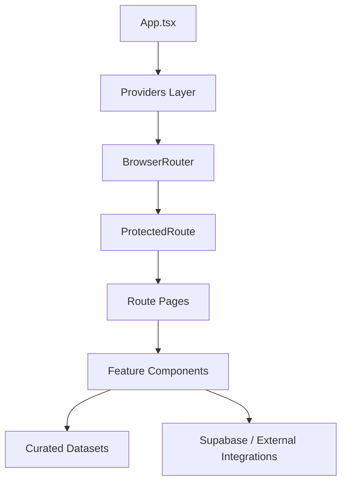
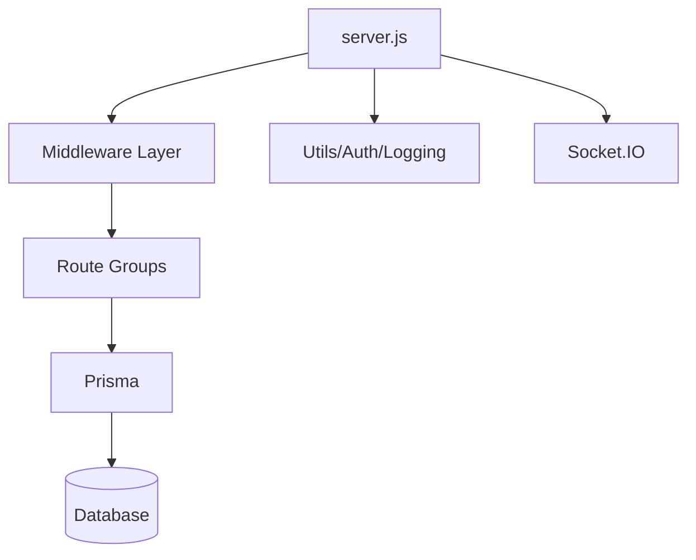

# App Structure

## Purpose

This document maps the full repository structure into business-friendly and technical-friendly views so you can explain the entire application clearly in a demo, viva, architecture review, or recruiter discussion.

## Repository map

```text
farm-intellect-65/
├── src/                        # Frontend React application
│   ├── assets/                 # Static frontend assets
│   ├── components/             # Reusable feature and UI components
│   ├── contexts/               # Global app state providers
│   ├── data/                   # Curated agricultural datasets
│   ├── hooks/                  # Reusable React hooks
│   ├── integrations/           # External service integration code
│   ├── lib/                    # Utilities, helpers, logger, error handling
│   ├── pages/                  # Route-level screens
│   ├── test/                   # Frontend test bootstrap
│   └── types/                  # Shared frontend/API types
├── backend/                    # Express backend service
│   ├── prisma/                 # Prisma schema and data model
│   ├── src/
│   │   ├── config/             # Backend configuration files
│   │   ├── middleware/         # Auth, activity, error middleware
│   │   ├── routes/             # REST API route groups
│   │   ├── utils/              # Tokens, logging, helpers
│   │   ├── healthApp.js        # Lightweight test-safe health app
│   │   └── server.js           # Main backend entry point
│   └── test/                   # Backend API tests
├── docs/                       # Architecture, security, data, flows, testing docs
├── public/                     # PWA and static public assets
├── supabase/                   # Supabase config, functions, migrations
└── .github/workflows/          # CI pipeline
```

## Frontend structure

### Frontend shell



### `src/components/` breakdown

| Folder | Responsibility |
|---|---|
| `ai/` | AI advisory and assistant interactions |
| `analytics/` | charts, trend views, metrics cards |
| `auth/` | login, password rules, identity flows |
| `calendar/` | crop schedule and reminders UI |
| `chat/` | messaging interface |
| `crops/` | crop intelligence and recommendations |
| `dashboard/` | role dashboard widgets |
| `documents/` | uploads, verification UI, file flows |
| `features/` | promotional or capability sections |
| `forum/` | community discussion UI |
| `home/` | landing page sections |
| `layout/` | navigation, shell, transitions |
| `notifications/` | alerts and notices |
| `punjab/` | regionalized/domain-specific UI modules |
| `system/` | cross-cutting system UX like error boundaries |
| `ui/` | base design-system primitives |

### `src/pages/` breakdown

#### Public pages

- `Index.tsx`
- `Login.tsx`
- `ResetPassword.tsx`
- `NotFound.tsx`

#### Farmer-facing pages

- `FarmerDashboard.tsx`
- `Crops.tsx`
- `Advisory.tsx`
- `Weather.tsx`
- `Sensors.tsx`
- `FieldMap.tsx`
- `Merchants.tsx`
- `Polls.tsx`
- `Schemes.tsx`
- `AIAdvisory.tsx`
- `Chat.tsx`
- `Forum.tsx`
- `Calendar.tsx`
- `Documents.tsx`
- `Notifications.tsx`
- `FarmFeatures.tsx`
- `Profile.tsx`

#### Merchant pages

- `merchant/MerchantFarmers.tsx`
- `merchant/MerchantMarketPrices.tsx`
- `merchant/MerchantDocuments.tsx`
- `merchant/MerchantNotifications.tsx`
- `MerchantDashboardPage.tsx`

#### Expert pages

- `expert/ExpertAICropScanner.tsx`
- `expert/ExpertAIAdvisory.tsx`
- `expert/ExpertChat.tsx`
- `expert/ExpertNotifications.tsx`
- `ExpertDashboardPage.tsx`

#### Admin pages

- `admin/AdminUsers.tsx`
- `admin/AdminAnalytics.tsx`
- `admin/AdminSettings.tsx`
- `admin/AdminNotifications.tsx`
- `AdminDashboardPage.tsx`

### Frontend state and logic layers

| Area | Key files | Purpose |
|---|---|---|
| Auth state | `contexts/AuthContext.tsx` | user session, auth state, protected access |
| Language state | `contexts/LanguageContext.tsx` | localization and multilingual support |
| Hooks | `hooks/*` | reusable logic wrappers |
| Error handling | `lib/error-handling.ts`, `components/system/AppErrorBoundary.tsx` | resilience and user-safe failure handling |
| Logging | `lib/logger.ts` | app-side diagnostics |
| Types | `types/api.ts` | starter shared response/request types |

## Backend structure

### Backend service map



### `backend/src/routes/` breakdown

| Route file | Responsibility |
|---|---|
| `auth.js` | signup, login, OTP/reset-style auth flows |
| `users.js` | profile management and farmer directory |
| `documents.js` | upload and document verification flows |
| `notifications.js` | user/admin notifications |
| `forum.js` | community posts and comments |
| `chat.js` | chat APIs |
| `analytics.js` | dashboard/analytics responses |
| `calendar.js` | crop calendar and scheduling APIs |
| `ai.js` | crop recommendation, disease, suggestion APIs |

### `backend/src/middleware/` role

This layer contains cross-cutting enforcement such as:

- JWT auth checks
- RBAC authorization
- activity logging
- centralized API error formatting

### `backend/src/utils/` role

This utility layer supports:

- token verification
- logging
- supporting helpers for secure backend operations

## Data structure

### Curated dataset modules in `src/data/`

| Dataset file | Primary use |
|---|---|
| `cropDiseases.ts` | disease and treatment knowledge |
| `cropRecommendations.ts` | recommendation engine |
| `cropProduction.ts` | production analytics |
| `mandiPrices.ts` | market intelligence |
| `kisanCallCenter.ts` | chatbot knowledge context |
| `satelliteData.ts` | NDVI and remote sensing guidance |
| `soilHealth.ts` | soil parameter and fertilizer context |
| `pestData.ts` | pest identification and IPM advice |
| `cropCalendar.ts` | seasonal planning and crop schedule |

## Platform and operations structure

### `supabase/`

- `config.toml` — Supabase project configuration
- `functions/` — edge functions
- `migrations/` — schema/migration history

### `public/`

- `manifest.json` — PWA manifest
- `robots.txt` — crawler rules
- `sw.js` — service worker

### `.github/workflows/`

- `ci.yml` — automated lint/test/build validation

## How to explain the structure in one minute

> The app is organized as a role-based React frontend, a modular Express backend, a curated agricultural knowledge layer under `src/data`, and a supporting Supabase/auth + CI/deployment layer. Each major user role has dedicated route pages, while the backend is split into route groups like auth, users, documents, analytics, calendar, chat, and AI.
