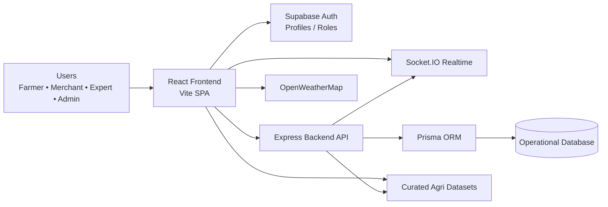
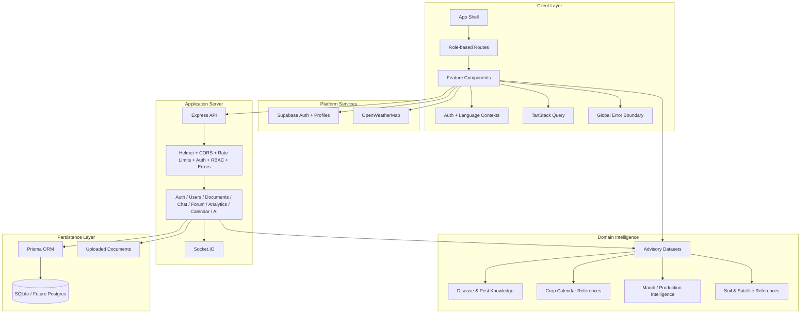
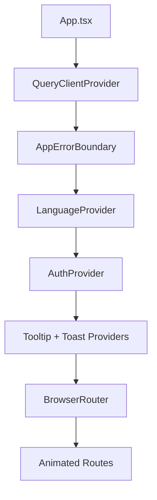
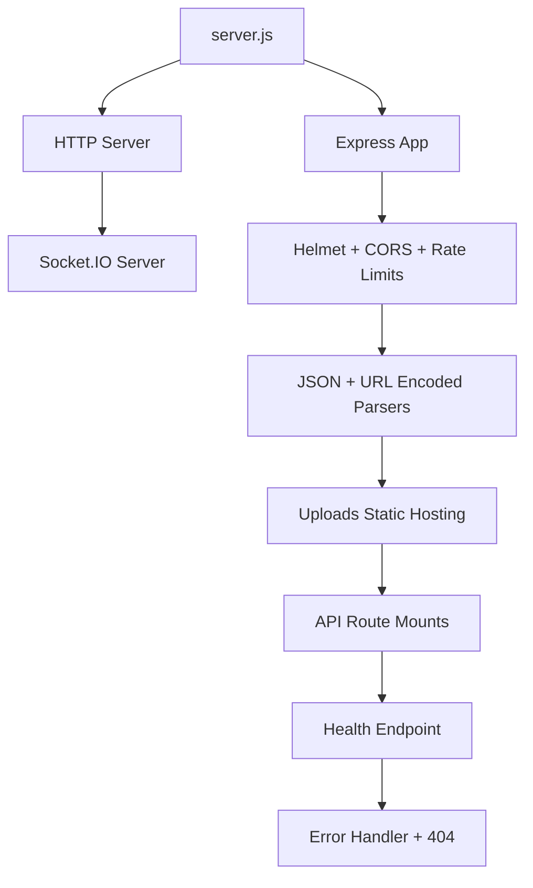
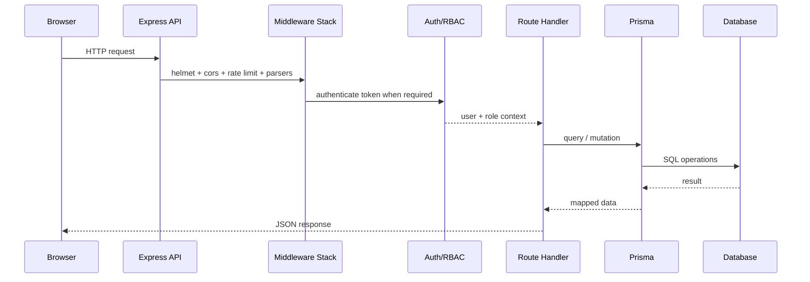
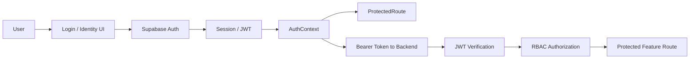
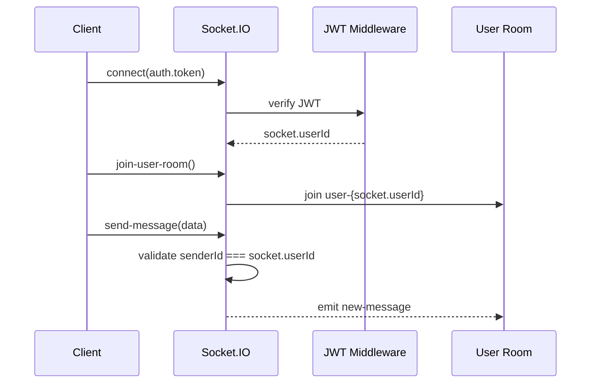
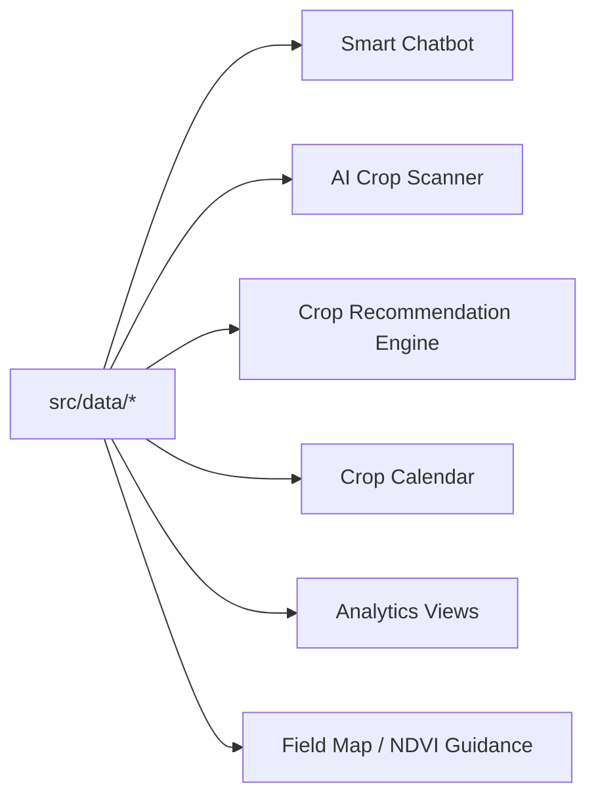
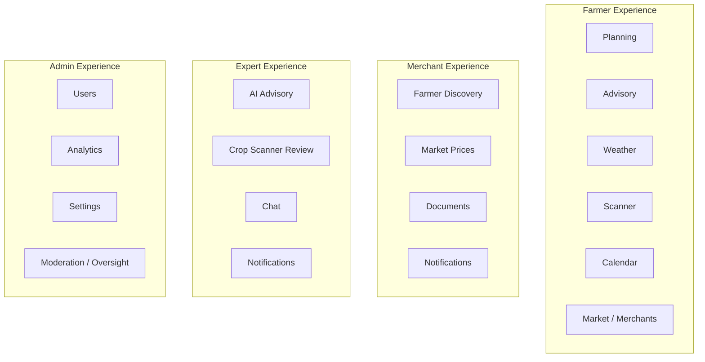

# Architecture

## Executive summary

Farm Intellect is a hybrid agricultural platform with four major user domains—farmer, merchant, expert, and admin—running on a shared frontend shell, a role-aware auth layer, a custom Express backend, curated advisory datasets, and realtime collaboration features.

At a high level, the system combines:

- a **React + Vite + TypeScript** frontend
- **Supabase** for authentication and profile/role integration
- a **Node.js + Express + Prisma** backend API
- a **dataset-driven agricultural intelligence layer**
- **Socket.IO** for authenticated realtime communication
- external platform integrations such as **OpenWeatherMap**

For a folder-by-folder map, see [`app-structure.md`](./app-structure.md). For enterprise-style system views, see [`system-design.md`](./system-design.md). For slide-ready flow diagrams, see [`flow-images.md`](./flow-images.md) and [`slide-diagram-assets.md`](./slide-diagram-assets.md). For explicit ownership boundaries in the hybrid architecture, see [`service-boundaries.md`](./service-boundaries.md).

## Important reviewer note: this is intentionally hybrid

This system is **not** a pure SPA + Supabase app and it is **not** a pure frontend + custom backend monolith either. It is a hybrid architecture with three distinct execution styles:

1. **frontend-local dataset features** for deterministic advisory and demo-friendly domain intelligence
2. **Supabase-managed identity/profile flows** for authentication and session handling
3. **custom backend service flows** for protected business logic, document workflows, notifications, analytics, chat, and operational APIs

Reviewers can get confused if these boundaries are left implicit. The correct way to read the app is:

- if a feature is advisory/reference heavy, it may resolve directly from curated `src/data/*`
- if a feature is identity/session related, it may use Supabase-managed auth/profile integration
- if a feature requires protected operations, moderation, documents, notifications, or server-side enforcement, it should go through the Express backend

This hybrid model is practical for the current product stage, but it requires very clear documentation so people do not assume inconsistent engineering where there is actually deliberate boundary mixing.

## System context diagram



## Layered architecture



## Frontend architecture

### App shell and providers

The frontend bootstraps through `src/App.tsx`, which composes the global application shell in this order:

1. `QueryClientProvider`
2. `AppErrorBoundary`
3. `LanguageProvider`
4. `AuthProvider`
5. `TooltipProvider`
6. `Toaster` + `Sonner`
7. `BrowserRouter`
8. role-aware route tree



### Frontend module map

#### Core areas

- `src/pages/*` — route-level screens
- `src/components/*` — reusable domain and UI components
- `src/contexts/*` — auth and language state
- `src/data/*` — curated agricultural knowledge and reference datasets
- `src/lib/*` — utilities, logging, streaming, and error helpers
- `src/hooks/*` — reusable hooks
- `src/integrations/*` — service integration code
- `src/test/*` — frontend test bootstrap
- `src/types/*` — shared application types and starter API DTOs

#### Feature component groups

- `components/ai/` — advisory and AI interaction widgets
- `components/analytics/` — charting and insights presentation
- `components/auth/` — login, validation, and identity UI
- `components/calendar/` — crop schedule UI
- `components/chat/` — chat interactions
- `components/crops/` — crop and recommendation UI
- `components/dashboard/` — role dashboard widgets
- `components/documents/` — document workflows
- `components/forum/` — community/forum experience
- `components/layout/` — layout shell and transitions
- `components/notifications/` — alerts and inbox UI
- `components/system/` — cross-cutting resilience/system UI
- `components/ui/` — primitive design-system components

### Route architecture

The frontend is organized around four primary role spaces plus legacy shared routes.

```mermaid
flowchart LR
    Root[/]/ --> Landing[Index]
    Login[/login/] --> Reset[/reset-password/]

    Farmer[/farmer/*/] --> FarmerDash[Dashboard]
    Farmer --> FarmerOps[Crops / Advisory / Weather / Sensors / Field Map]
    Farmer --> FarmerComm[Chat / Forum / Notifications]
    Farmer --> FarmerDocs[Documents / Calendar / Profile / Features]

    Merchant[/merchant/*/] --> MerchantDash[Dashboard]
    Merchant --> MerchantOps[Farmers / Market Prices / Documents / Notifications / Profile]

    Expert[/expert/*/] --> ExpertDash[Dashboard]
    Expert --> ExpertOps[AI Crop Scanner / AI Advisory / Chat / Notifications / Profile]

    Admin[/admin/*/] --> AdminDash[Dashboard]
    Admin --> AdminOps[Users / Analytics / Settings / Notifications / Profile]
```

### Route inventory from `src/App.tsx`

#### Public routes

- `/`
- `/login`
- `/reset-password`

#### Farmer routes

- `/farmer/dashboard`
- `/farmer/crops`
- `/farmer/advisory`
- `/farmer/weather`
- `/farmer/sensors`
- `/farmer/field-map`
- `/farmer/merchants`
- `/farmer/polls`
- `/farmer/schemes`
- `/farmer/ai-advisory`
- `/farmer/chat`
- `/farmer/forum`
- `/farmer/calendar`
- `/farmer/documents`
- `/farmer/notifications`
- `/farmer/features`
- `/farmer/profile`

#### Merchant routes

- `/merchant/dashboard`
- `/merchant/farmers`
- `/merchant/market-prices`
- `/merchant/documents`
- `/merchant/notifications`
- `/merchant/profile`

#### Expert routes

- `/expert/dashboard`
- `/expert/ai-crop-scanner`
- `/expert/ai-advisory`
- `/expert/chat`
- `/expert/notifications`
- `/expert/profile`

#### Admin routes

- `/admin/dashboard`
- `/admin/users`
- `/admin/analytics`
- `/admin/settings`
- `/admin/notifications`
- `/admin/profile`

#### Legacy shared routes

Legacy shared paths such as `/dashboard`, `/crops`, `/weather`, `/forum`, `/calendar`, and `/chat` remain in place for compatibility and routing flexibility.

## Backend architecture

### Server composition

The backend entry point is `backend/src/server.js`.

Its responsibilities are:

- load environment configuration
- initialize Express
- create the HTTP server
- attach Socket.IO
- register middleware
- mount route groups
- expose health status
- apply authenticated realtime rules
- install centralized error handling



### Backend route groups

The current route modules are:

- `auth.js`
- `users.js`
- `documents.js`
- `notifications.js`
- `forum.js`
- `chat.js`
- `analytics.js`
- `calendar.js`
- `ai.js`

### Middleware stack

The backend currently applies or references the following middleware layers:

- `helmet()` for HTTP hardening
- `cors()` with environment-aware origin control
- global rate limiting
- route-specific limiters for auth, chat, and AI
- JSON and form body parsing
- JWT verification
- RBAC authorization middleware
- centralized error handling

### Request lifecycle



## Auth and access-control architecture

Authentication is split across frontend identity management and backend protected route access.



### Access model

- frontend route protection uses `ProtectedRoute`
- backend security relies on token verification and role-based authorization
- selected routes now explicitly enforce role checks through `authorize(...)`

## Realtime architecture

Socket.IO is used as a controlled realtime channel for direct user-room communication.



### Realtime safety properties

- socket connection requires token presence
- token is verified before session acceptance
- users can only join their own user room
- outbound events verify sender identity before forwarding

## Advisory and dataset architecture

The application uses curated datasets stored under `src/data/` to power explainable, deterministic, and domain-rich user experiences.

### Current dataset-powered feature areas

- Smart chatbot
- AI crop scanner
- crop recommendation engine
- crop calendar advisory
- production and mandi analytics
- field NDVI and vegetation guidance
- pest and soil advisory support



### Why this matters in presentations

This design is one of the strongest parts of the project because it makes the app:

- explainable instead of opaque
- demoable even without live third-party data for every flow
- domain-rich instead of generic AI-wrapper UI

## Hybrid ownership model

The most important architectural clarification is **ownership**.

| Concern | Primary owner | Why |
|---|---|---|
| UI rendering and route composition | Frontend React app | all user experiences originate here |
| Auth session and profile/role integration | Supabase + frontend auth context | Supabase is the identity layer |
| Protected business APIs | Express backend | enforces auth, RBAC, rate limits, route policy |
| Domain advisory knowledge | `src/data/*` curated datasets | deterministic, explainable, demo-stable intelligence |
| Operational persistence | Prisma-managed backend database | notifications, documents, forum, chat, activity, operational records |
| Realtime protected messaging | Socket.IO on backend | requires authenticated server-side channel |
| Weather enrichment | OpenWeatherMap + frontend integration | external enrichment rather than core ownership |

### Where confusion usually happens

The confusing parts are usually these:

- **"Why isn’t everything in Supabase?"**
  - because the app also needs a custom protected backend for route-specific enforcement and business operations
- **"Why are datasets in the frontend?"**
  - because a large part of the advisory product is explainable knowledge delivery, not only transactional CRUD
- **"Why not move all logic to the backend?"**
  - that is a valid future direction for some domains, but today the curated datasets provide speed, reliability, explainability, and easier product demos

### Boundary rule of thumb

- use **frontend datasets** for advisory intelligence, deterministic knowledge, and explainable presentation logic
- use **Supabase** for identity/session responsibilities
- use the **custom backend** for protected business workflows, persistence, moderation, uploads, notifications, and realtime enforcement

## Role-centric product architecture



## Architecture strengths

- clear role-driven UX model
- strong modular separation in frontend folders
- backend middleware and security posture are visible and explainable
- curated datasets make product intelligence demonstrable
- realtime layer is now JWT-protected
- documentation now maps both structure and flow in presentation-friendly terms

## Architectural trade-offs

- hybrid Supabase + custom backend increases coordination complexity
- some features are dataset-first rather than service-first
- typed frontend/backend contracts are still in starter state
- request validation is not yet standardized across every route group
- current persistence shape is suitable for development/demo, but production should move to a stronger database strategy

## Documentation and test-support gaps still visible

Even after the current documentation pass, reviewers can still reasonably point out a few maturity gaps:

- there was no dedicated service-boundaries document until now
- hybrid ownership needs repeated explanation across docs, not only one architecture diagram
- testing currently proves baseline quality, but not full end-to-end confidence across auth, RBAC, uploads, and realtime
- typed contracts and request validation are documented as in-progress rather than complete

These are known gaps, not hidden ones, and they should be presented honestly as part of the roadmap.

## Recommended next upgrades

- unify API contracts with OpenAPI or shared validation schemas
- move request validation into reusable schema-driven middleware
- add background jobs for refresh, reminders, and notification fan-out
- introduce monitoring, tracing, and alerting
- split future ML/scanner inference into its own service boundary
- migrate to production-grade database infrastructure for scale
