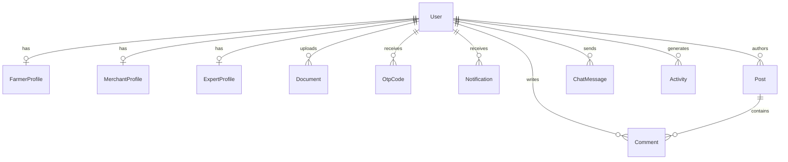
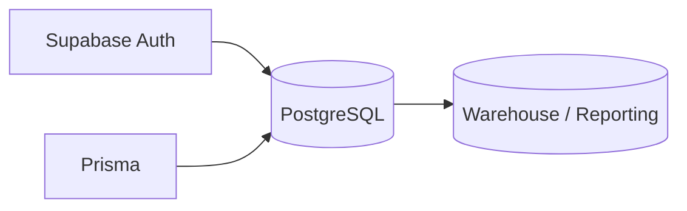

# Database Design

## Overview

The project currently uses two data planes:

1. **Supabase tables** for frontend-facing auth/profile integrations
2. **Prisma models** in `backend/prisma/schema.prisma` for backend operational data

This split should be documented clearly in presentations because it is one of the main architectural nuances of the project.

## Prisma ER overview

## Core Prisma models

### `User`
Stores authentication-adjacent account information for the custom backend domain.

Important fields:
- `email`
- `password`
- `role`
- `isVerified`
- `emailVerified`
- `phoneVerified`

### Role-specific profiles

- `FarmerProfile`
- `MerchantProfile`
- `ExpertProfile`

These extend the `User` model with role-specific metadata.

### Collaboration and content

- `Post`
- `Comment`
- `Notification`
- `ChatMessage`
- `Activity`

### Operations and compliance

- `Document`
- `OtpCode`
- `CropCalendar`
- `AIRecommendation`

## Supabase-side tables

Based on current frontend auth usage and migrations:

- `profiles`
- `user_roles`

These support the Supabase-authenticated frontend experience.

## Database design strengths

- clear role separation
- straightforward one-to-one role profile extension pattern
- documents/notifications/chat/activity are modeled independently
- backend operational tables are presentation-friendly and easy to explain

## Design gaps / future improvements

- unify Supabase and Prisma data ownership strategy
- move from SQLite to PostgreSQL/MySQL for production scale
- add migration/version strategy across both backend and Supabase schemas
- encrypt sensitive fields at rest if Aadhaar/regulated identifiers are ever persisted
- add audit tables for admin moderation and document verification decisions
- add freshness/version tracking to advisory records

## Suggested production target model

## Data governance recommendations

- do not store Aadhaar values unless absolutely necessary
- if stored in future, encrypt at rest and mask in application views
- version dataset imports separately from transactional data
- add retention policies for logs, OTP records, and file uploads
