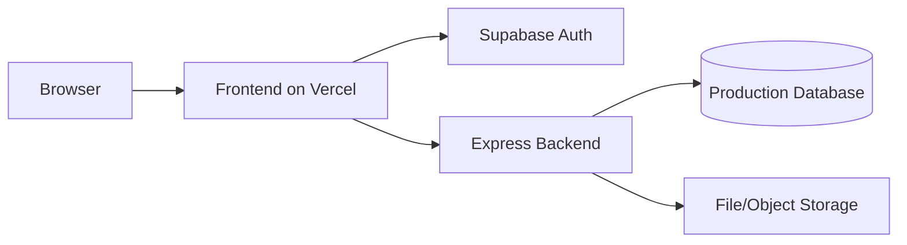

# Deployment Guide

## Deployment topology

### Frontend
- Vite SPA
- deployable to Vercel

### Backend
- Node.js Express service
- deploy separately (Render, Railway, Fly.io, Azure App Service, VPS, etc.)

### Auth / managed services
- Supabase project for authentication and profile tables

## Required environment variables

### Frontend `.env`

- `VITE_SUPABASE_URL`
- `VITE_SUPABASE_PUBLISHABLE_KEY`
- `VITE_SUPABASE_PROJECT_ID`
- `VITE_OWM_API_KEY`

### Backend `.env`

Recommended:

- `PORT=3001`
- `NODE_ENV=production`
- `FRONTEND_URL=https://your-frontend-domain`
- `JWT_SECRET=<strong-random-secret>`
- `JWT_EXPIRES_IN=7d`
- `BCRYPT_ROUNDS=12`
- `RATE_LIMIT_WINDOW_MS=900000`
- `RATE_LIMIT_MAX_REQUESTS=100`
- `MAX_FILE_SIZE=10485760`
- database connection settings if moving beyond SQLite

## Frontend build

```bash
npm install
npm run build
```

## Backend run

```bash
cd backend
npm install
npm run start
```

## Vercel notes

The repository already includes `vercel.json` for SPA routing support.

## Supabase notes

- ensure redirect URLs match the deployed frontend domain
- keep `verify_jwt = true` for protected edge functions
- keep leaked password protection enabled

## Production checklist

- rotate all exposed or previously hardcoded secrets
- set production CORS origin to the actual frontend domain
- configure persistent storage for uploads if needed
- switch SQLite to a production-grade relational database
- configure logs retention and alerting
- enable HTTPS end to end

## Recommended deployment model



## CI/CD

A GitHub Actions workflow now exists at `.github/workflows/ci.yml` for:

- frontend lint
- frontend tests
- frontend build
- backend tests
