# Flow Images

## Purpose

This page contains presentation-ready Mermaid diagrams for the main product, data, and technical flows of Farm Intellect. These are the strongest "flow images" to show in a demo deck or architecture review.

## 1. Full app navigation flow

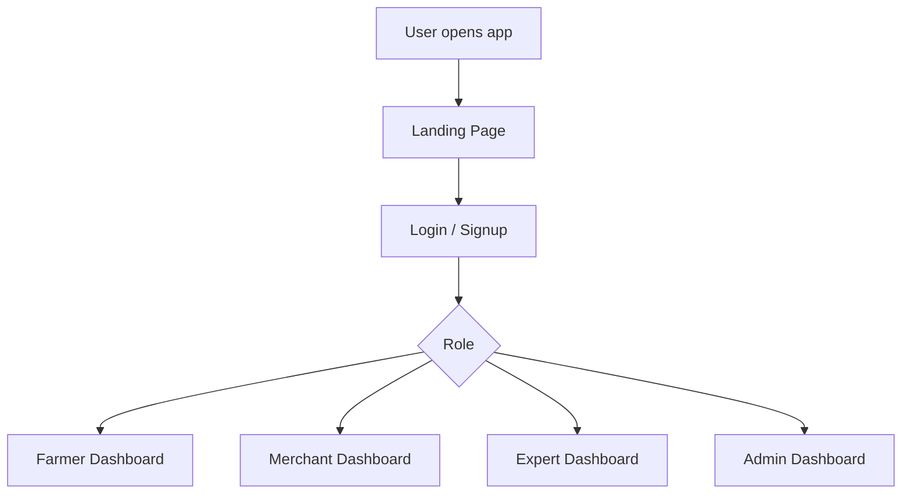

## 2. Authentication flow image

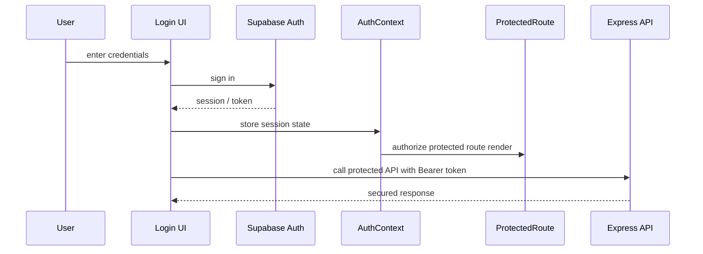

## 3. Farmer advisory journey image

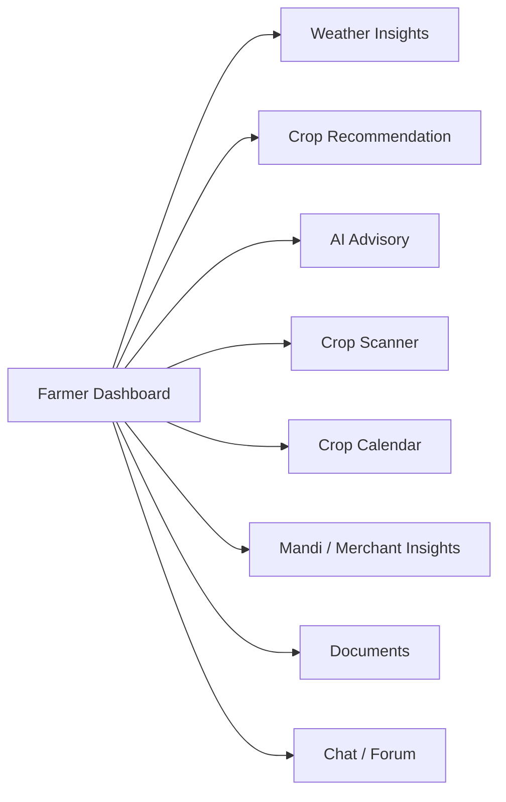

## 4. Crop recommendation flow image

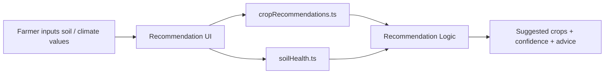

## 5. Crop scanner flow image

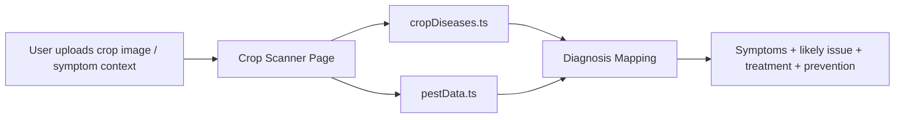

## 6. Chatbot knowledge flow image

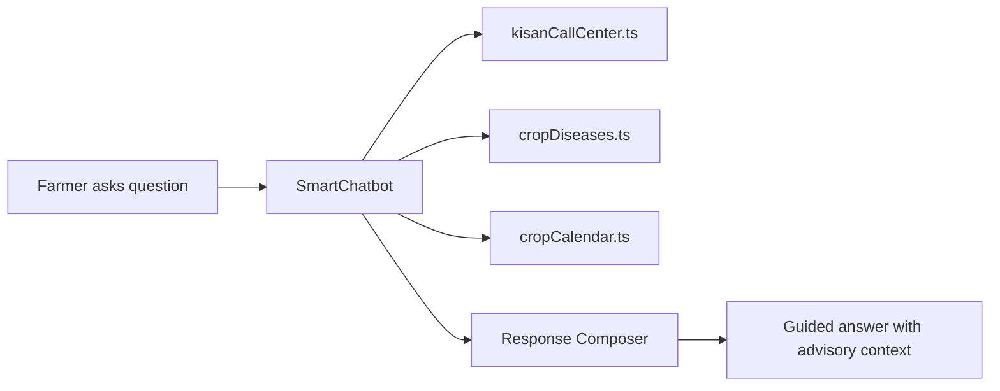

## 7. Analytics flow image

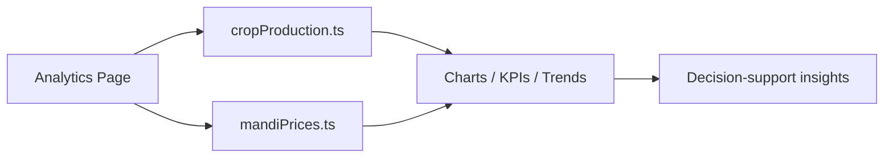

## 8. Field map / satellite flow image

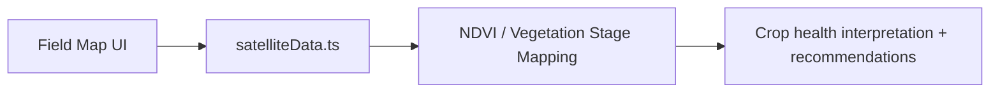

## 9. Backend request flow image

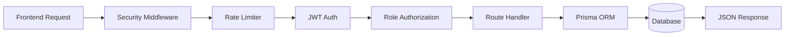

## 10. Realtime messaging flow image

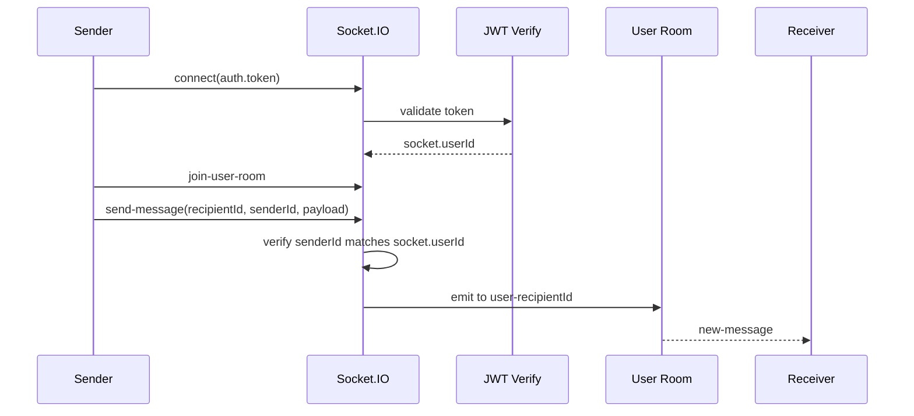

## 11. Document verification flow image

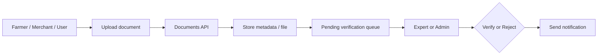

## 12. Admin control flow image

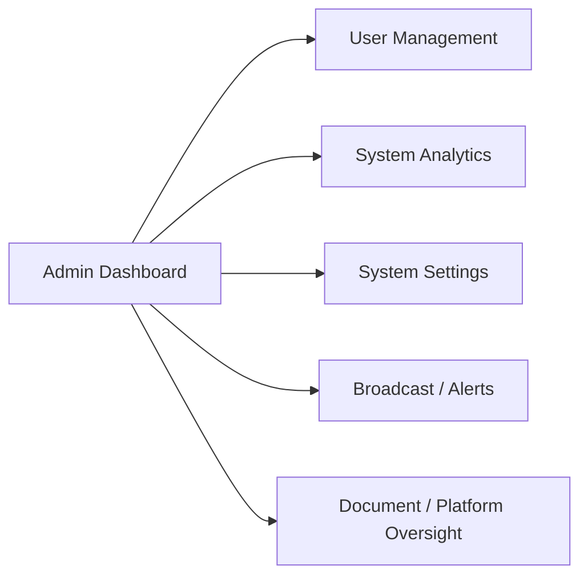

## Best images to put in slides

If you only use 4 diagrams in a presentation, use these:

1. Full app navigation flow
2. Layered architecture from `architecture.md`
3. Crop scanner flow image
4. Backend request flow image
