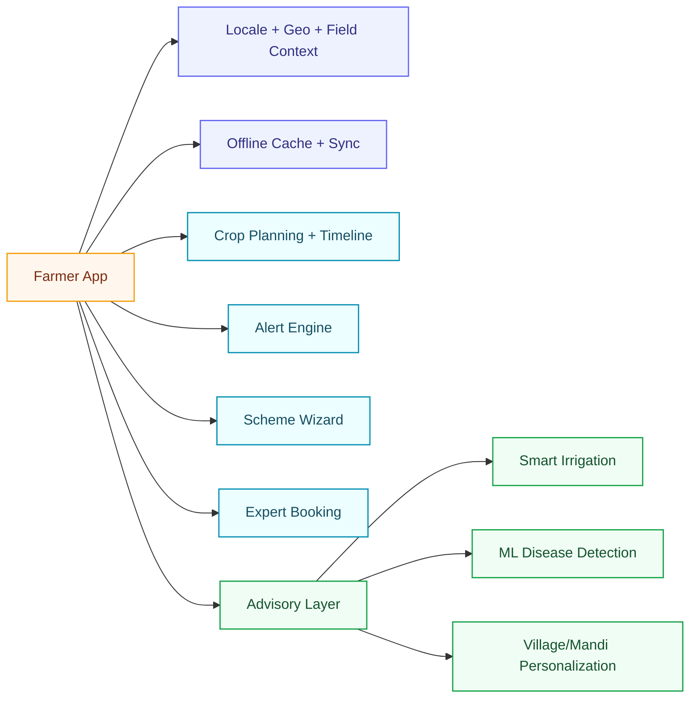

# Future Capabilities

## Purpose

This document turns the next feature wave into a structured product and architecture expansion plan. Instead of treating new features as isolated screens, it defines what each capability means, what system changes it requires, and how it should evolve from MVP to production-grade implementation.

## Capability map

```mermaid
flowchart TB
    classDef farmer fill:#FFF7ED,stroke:#F59E0B,color:#7C2D12,stroke-width:1.4px;
    classDef intelligence fill:#EEF2FF,stroke:#6366F1,color:#312E81,stroke-width:1.4px;
    classDef operations fill:#ECFEFF,stroke:#0891B2,color:#164E63,stroke-width:1.4px;
    classDef platform fill:#F0FDF4,stroke:#16A34A,color:#14532D,stroke-width:1.4px;

    NextWave[Next Capability Wave]:::platform

    NextWave --> FarmerMode[Farmer Productivity]:::farmer
    NextWave --> Intelligence[Intelligent Advisory]:::intelligence
    NextWave --> Ops[Operational Workflows]:::operations
    NextWave --> Context[Localization + Personalization]:::platform

    FarmerMode --> Offline[Offline / PWA-first Mode]:::farmer
    FarmerMode --> Planning[Personalized Crop Planning]:::farmer
    FarmerMode --> History[Field History Timeline]:::farmer

    Intelligence --> DiseaseML[ML Disease Detection]:::intelligence
    Intelligence --> Irrigation[Smart Irrigation Advisory]:::intelligence
    Intelligence --> Alerts[Alert Engine]:::intelligence

    Ops --> Wizard[Scheme Eligibility Wizard]:::operations
    Ops --> ExpertBooking[Expert Booking Workflow]:::operations

    Context --> Multilingual[Multilingual Support]:::platform
    Context --> Geo[Village / Mandi Geo-personalization]:::platform
```

## Expansion principles

- every feature must have a clear owner across frontend, backend, datasets, models, and notifications
- farmer-facing capabilities should remain explainable even when ML is introduced
- offline and alerting features require event-driven thinking, not only page-based thinking
- workflow-heavy capabilities should be modeled as stateful business processes, not just forms

## 1. Multilingual support expansion

### Product goal

Support farmers in local languages with clearer labels, content, advisory responses, and eventually voice-first interactions.

### User value

- lowers usage barriers for farmers
- improves trust in advisory flows
- makes scheme and crop guidance easier to understand

### Architecture impact

- stronger i18n layer in the frontend
- translation/resource management for UI + advisory content
- locale-aware content selection in chatbot and recommendation flows
- possible TTS/STT pipeline for future voice support

### MVP scope

- Hindi + Punjabi + English UI labels
- localized advisory text variants for core flows
- locale preference saved in user profile

### Production-grade direction

- content translation workflow
- voice input/output support
- localized dataset metadata and pronunciation hints

## 2. Offline / PWA-first farmer mode

### Product goal

Allow farmers to continue using critical features during poor or no connectivity.

### User value

- reliable access in rural network conditions
- better adoption in field scenarios
- continuity for planning and record capture

### Architecture impact

- stronger service worker strategy
- local data caching and sync queue design
- conflict resolution for delayed writes
- offline-safe UI states for forms and history views

### MVP scope

- cache core farmer pages
- offline access to crop calendar, basic recommendations, and field records
- queue user actions for later sync

### Production-grade direction

- background sync
- conflict handling rules
- offline notifications/inbox fallback states

## 3. Image-based disease detection with ML model

### Product goal

Upgrade scanner flows from reference-assisted analysis to actual image-driven inference.

### User value

- faster disease triage
- higher accuracy for image-first use cases
- more compelling scanner experience for demos and real use

### Architecture impact

- introduce a dedicated model-serving or inference boundary
- separate upload, inference, enrichment, and audit steps
- combine model confidence with curated disease explanations

### MVP scope

- inference API for a limited set of crops/diseases
- confidence thresholding
- fallback to curated advisory when confidence is low

### Production-grade direction

- versioned models
- inference monitoring
- human review/escalation path for low-confidence cases

## 4. Personalized crop planning

### Product goal

Move from one-time recommendation to season-long planning tailored to field, crop, budget, and goals.

### User value

- actionable planning, not only suggestions
- stronger repeat engagement
- clearer seasonal decision support

### Architecture impact

- persistent planning objects in the backend
- planning templates + rule engine
- recommendation outputs converted into timeline tasks

### MVP scope

- create crop plans by season and field
- generate sowing, fertilizer, irrigation, and harvest checkpoints
- show plan status by stage

### Production-grade direction

- dynamic re-planning based on weather, disease, and market changes
- profit/risk scenario modeling

## 5. Field history timeline

### Product goal

Track the past state of each field across seasons, actions, advisories, and outcomes.

### User value

- long-term learning for farmers
- better expert consultation context
- stronger analytics and plan personalization inputs

### Architecture impact

- timeline/event model in backend persistence
- field activity records linked to plans, scans, advisories, and alerts
- visualization layer in frontend dashboards

### MVP scope

- create and view season-by-season field history
- log major events: crop grown, scan results, irrigation events, and advisory changes

### Production-grade direction

- event sourcing style history view
- comparison across seasons and fields

## 6. Subsidy / scheme eligibility wizard

### Product goal

Guide farmers through scheme discovery and eligibility using structured inputs instead of manual searching.

### User value

- faster scheme awareness
- reduced confusion in policy discovery
- stronger practical usefulness beyond advisory content

### Architecture impact

- eligibility rules engine
- profile + farm context matching
- explainable recommendation flow with rule traceability

### MVP scope

- wizard with landholding, crop, irrigation, and category inputs
- shortlist likely matching schemes
- explain why a scheme is recommended

### Production-grade direction

- state and district-specific rules
- application checklist generator
- document prefill assistance

## 7. Smart irrigation advisory

### Product goal

Provide irrigation recommendations using crop stage, soil condition, weather, and field context.

### User value

- better water use efficiency
- lower resource wastage
- more practical day-to-day advisory utility

### Architecture impact

- fuse weather data, crop plan stage, field profile, and soil rules
- possibly integrate sensor inputs later
- new advisory scoring or rule engine

### MVP scope

- stage-based irrigation recommendation using crop + weather + soil references
- farmer-facing “irrigate now / wait / monitor” guidance

### Production-grade direction

- sensor-driven precision irrigation
- anomaly detection for over/under-irrigation risk

## 8. Alert engine for pests / weather / market drops

### Product goal

Move the product from passive lookup to proactive advisory.

### User value

- timely response to crop risks and price changes
- stronger retention and engagement
- higher real-world usefulness

### Architecture impact

- event/rule engine
- notification channels and delivery preferences
- scheduled jobs and alert suppression logic

### MVP scope

- threshold-based alerts for weather risk, pest outbreaks, and mandi price drops
- notifications in-app first

### Production-grade direction

- WhatsApp/SMS/push channels
- geo-targeted alert segmentation
- per-user alert preferences and quiet hours

## 9. Expert booking + consultation workflow

### Product goal

Allow farmers to escalate from AI/dataset guidance to a human expert workflow.

### User value

- trust-building human support path
- monetization/service-delivery potential
- better continuity between AI and expert assistance

### Architecture impact

- appointment/workflow state machine
- expert availability, booking, notes, and session history
- notification and reminder flows

### MVP scope

- request consultation
- choose expert/time slot
- track booking status

### Production-grade direction

- video/voice session integration
- payment or package layer
- expert notes linked to field history

## 10. Village / mandi geo-personalization

### Product goal

Make recommendations, alerts, and prices more locally relevant.

### User value

- stronger precision and trust
- better market relevance
- more context-aware advisory outputs

### Architecture impact

- location model in profile and field context
- mandi and district mapping services
- localized advisory and alert segmentation

### MVP scope

- select village/district/mandi
- personalize nearby mandi prices and selected advisory cards

### Production-grade direction

- location clustering
- district-specific weather and pest advisories
- village-level service personalization

## Recommended implementation sequence

### Wave 1 — usability and farmer retention

- multilingual support expansion
- offline/PWA-first farmer mode
- personalized crop planning
- field history timeline

### Wave 2 — smarter advisory and proactive support

- smart irrigation advisory
- alert engine
- village/mandi geo-personalization
- scheme eligibility wizard

### Wave 3 — deep intelligence and assisted services

- image-based disease detection with ML model
- expert booking + consultation workflow

## Future-state system view

## What this means for the architecture

These features push the product toward five new system responsibilities:

1. **localization and profile context management**
2. **offline caching and deferred synchronization**
3. **stateful farm records and timelines**
4. **rules/event engines for alerts, irrigation, and scheme matching**
5. **dedicated intelligence services for ML inference and escalation workflows**

That is why these features should be treated as an expansion program, not just a UI wishlist.