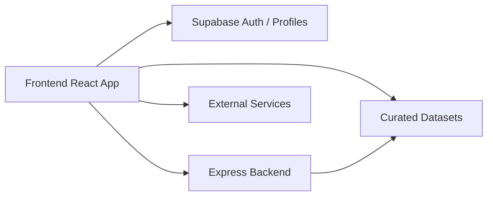

# Service Boundaries

## Why this document exists

Farm Intellect uses a hybrid architecture. Without an explicit service-boundaries document, reviewers can mistake deliberate architectural trade-offs for inconsistency.

This page answers one central question:

> **Which layer owns which responsibility?**

## Boundary summary

## Ownership matrix

| Concern | Owner | Secondary participant | Notes |
|---|---|---|---|
| UI composition and navigation | Frontend | — | route tree, pages, components, transitions |
| Authentication | Supabase | Frontend auth context | identity/session origin lives in Supabase integration |
| Protected route rendering | Frontend | Supabase session data | `ProtectedRoute` decides renderability |
| Role-aware backend access | Backend | frontend bearer token | backend enforces route policy and RBAC |
| Advisory intelligence | Curated datasets | Frontend components | deterministic and explainable domain logic |
| Weather enrichment | External services | Frontend | supporting enrichment, not core ownership |
| Documents, moderation, notifications, forum, chat ops | Backend | database + frontend clients | server-side operational business logic |
| Realtime messaging enforcement | Backend Socket.IO | frontend socket client | authenticated room join and sender validation |
| Persistent operational records | Backend database | Prisma | operational storage layer |

## The three execution styles

### 1. Dataset-driven frontend features

These are features where the main value is explainable agricultural knowledge rather than heavy server-side processing.

Examples:

- crop recommendation guidance
- crop disease and pest reference flows
- crop calendar advisory
- production and mandi insights views
- field health interpretation using curated reference thresholds

Why this is acceptable today:

- faster demos
- deterministic outputs
- strong explainability
- reduced dependence on live backend processing for every advisory interaction

### 2. Supabase-driven identity features

These are features where identity/session management is the main concern.

Examples:

- login/session bootstrap
- profile/role lookup and auth context hydration
- protected route access decisions in the frontend shell

Why this boundary exists:

- managed auth is easier and safer than building every auth primitive from scratch
- it reduces identity complexity in the custom backend

### 3. Custom backend-driven operational features

These are features where server-side enforcement and business policy matter.

Examples:

- document verification
- notifications
- forum operations
- protected chat APIs
- analytics endpoints
- AI/protected backend routes
- rate limiting, RBAC, audit-style control points

Why this boundary exists:

- operational security belongs on the server
- RBAC and policy enforcement should not rely only on frontend checks
- uploads, notifications, and moderation need central control

## Feature-to-boundary map

| Feature | Primary path |
|---|---|
| Landing page and public content | Frontend only |
| Login/session | Frontend ↔ Supabase |
| Farmer dashboard rendering | Frontend + datasets + some backend/API enrichment |
| Smart chatbot | Frontend + curated datasets |
| Crop scanner advisory | Frontend + curated disease/pest datasets |
| Calendar advisory | Frontend + curated calendar dataset + optional backend calendar APIs |
| Merchant farmer discovery | Frontend ↔ Backend |
| Documents | Frontend ↔ Backend |
| Notifications | Frontend ↔ Backend |
| Forum | Frontend ↔ Backend |
| Realtime chat | Frontend ↔ Backend Socket.IO |
| Analytics | Frontend + datasets and/or backend analytics APIs |

## Where the architecture can feel inconsistent

Reviewers may ask:

- why does some intelligence come from local files?
- why does auth rely on Supabase while business APIs rely on Express?
- why do some features appear frontend-heavy while others are server-heavy?

The answer is:

> the product is currently optimized for a blend of explainable domain intelligence, fast iteration, and protected operational workflows. Different concerns were assigned to the layer that currently gives the best trade-off for speed, clarity, and control.

## What would make the boundaries stronger over time

- shared schema definitions across frontend and backend
- stronger API contract generation
- more integration tests across hybrid boundaries
- explicit service ownership notes for each major feature module
- possible migration of some dataset-driven logic into versioned backend/domain services where needed

## Reviewer-facing summary

This architecture is hybrid by design, not by accident. The important thing is to evaluate it as:

- **Supabase for identity**
- **Express for protected operations**
- **curated datasets for explainable agricultural intelligence**
- **React as the orchestration shell that brings those layers together**