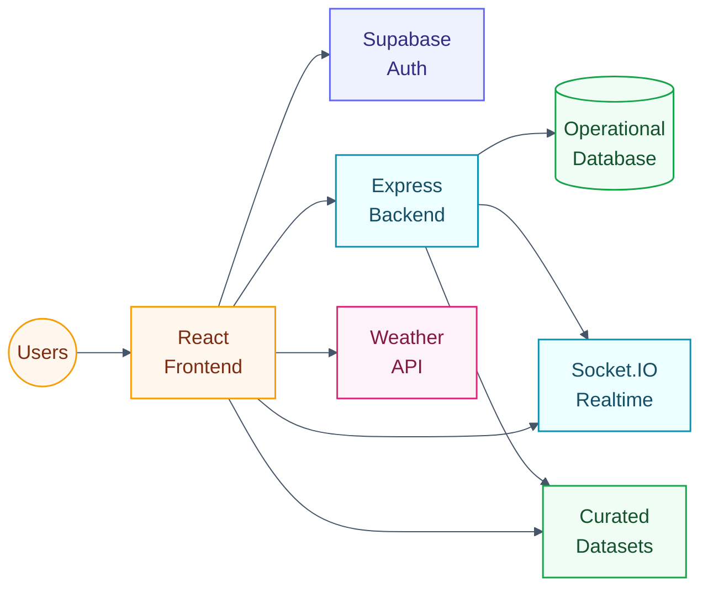
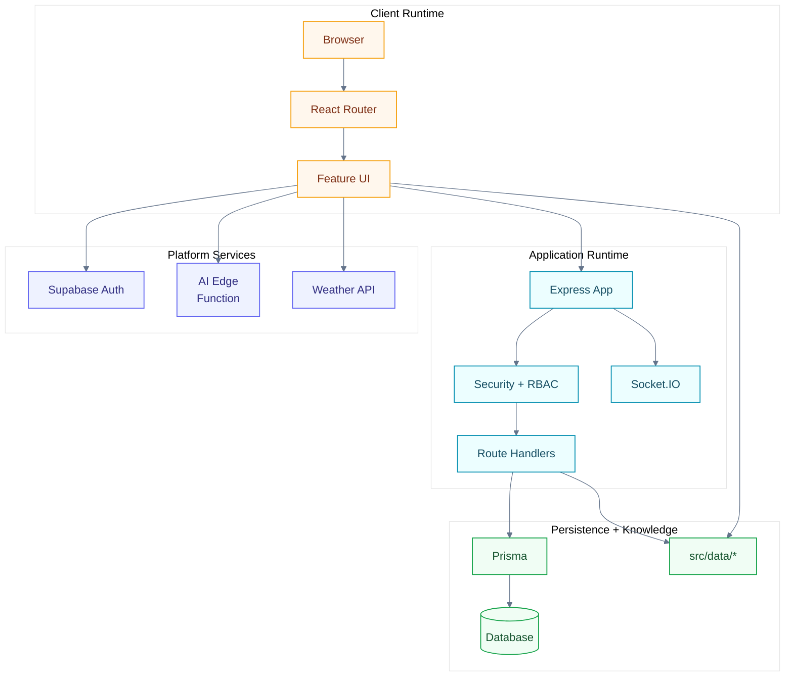
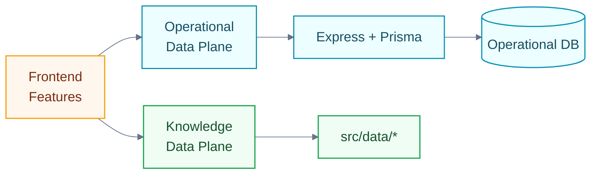
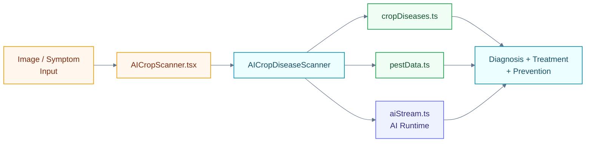
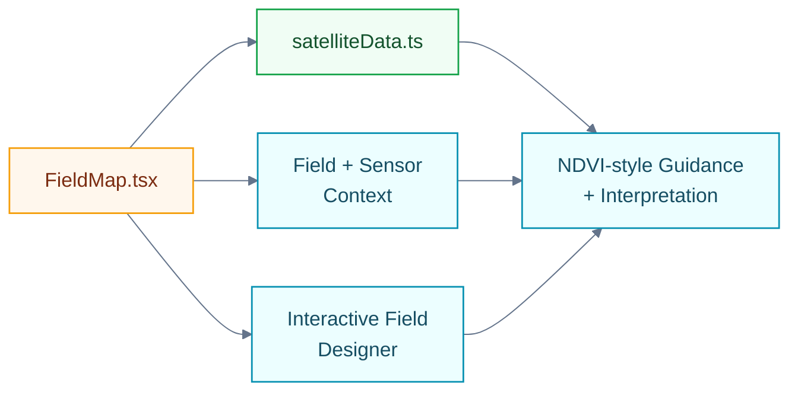
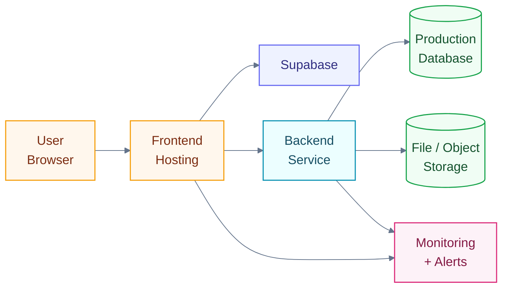

# Slide Diagram Assets

## Purpose

This document packages the Mermaid diagrams into a slide-ready export set for PNG and SVG generation. Use **SVG as the primary format** for PowerPoint, Figma, Canva, or Google Slides. Export PNG only when a raster format is required by the presentation tool.

## Export standards

- preferred format: `SVG`
- fallback format: `PNG`
- recommended slide width target: `1600x900` or `1920x1080`
- background: solid white
- keep titles outside the exported graphic when possible so slide typography stays consistent
- use one diagram per slide unless explicitly paired in the placement guide

## Visual refinement rules

Use these rules when exporting or editing the diagrams for a presentation:

- keep each diagram to **3–5 visual groups** max
- prefer **left-to-right** flow for architecture slides and **top-to-bottom** only for stacked runtime views
- use **short node labels** with line breaks instead of long paragraphs inside shapes
- reserve **warm colors** for client/business-facing nodes and **cool colors** for protected/platform nodes
- keep database/storage nodes visually distinct with cylinder shapes
- use **dashed edges** only for optional or future paths
- avoid edge crossings where possible; whitespace is a feature, not a bug

## Recommended export manifest

| Asset ID | Export filenames | Best use |
|---|---|---|
| D1 | `docs/assets/diagrams/01-system-context.svg` / `.png` | architecture overview slide |
| D2 | `docs/assets/diagrams/02-runtime-container-view.svg` / `.png` | enterprise system-design slide |
| D3 | `docs/assets/diagrams/03-hybrid-data-plane.svg` / `.png` | hybrid ownership explanation |
| D4 | `docs/assets/diagrams/04-ai-advisory-architecture.svg` / `.png` | AI advisory feature slide |
| D5 | `docs/assets/diagrams/05-crop-scanner-architecture.svg` / `.png` | crop scanner feature slide |
| D6 | `docs/assets/diagrams/06-analytics-architecture.svg` / `.png` | analytics feature slide |
| D7 | `docs/assets/diagrams/07-field-map-architecture.svg` / `.png` | field-map feature slide |
| D8 | `docs/assets/diagrams/08-chat-architecture.svg` / `.png` | chat/realtime feature slide |
| D9 | `docs/assets/diagrams/09-backend-request-flow.svg` / `.png` | security/backend request slide |
| D10 | `docs/assets/diagrams/10-deployment-topology.svg` / `.png` | deployment / enterprise readiness slide |

## D1 — System context

Suggested slide title: **Farm Intellect system context**



Recommended caption: **Hybrid by design: React orchestrates user journeys, Supabase handles identity, Express protects operational workflows, and curated datasets power explainable agricultural intelligence.**

## D2 — Runtime container view

Suggested slide title: **Runtime container view**



Recommended caption: **The platform is organized as a client runtime, managed platform services, a protected application runtime, and split persistence/knowledge boundaries.**

## D3 — Hybrid data-plane model

Suggested slide title: **Operational vs knowledge data planes**



Recommended caption: **Operational records and advisory knowledge are intentionally separated so the product can be both secure and explainable.**

## D4 — AI advisory architecture

Suggested slide title: **AI advisory architecture**

```mermaid
%%{init: {'theme': 'base', 'themeVariables': { 'lineColor': '#64748B', 'fontSize': '17px'}}}%%
flowchart LR
    classDef page fill:#FFF7ED,stroke:#F59E0B,color:#7C2D12,stroke-width:1.4px;
    classDef logic fill:#ECFEFF,stroke:#0891B2,color:#164E63,stroke-width:1.4px;
    classDef data fill:#F0FDF4,stroke:#16A34A,color:#14532D,stroke-width:1.4px;
    classDef api fill:#EEF2FF,stroke:#6366F1,color:#312E81,stroke-width:1.4px;

    Inputs[Farmer / Expert<br/>Inputs]:::page --> Page[AIAdvisory.tsx]:::page
    Page --> Engine[Crop Recommendation<br/>Engine]:::logic
    Page --> Yield[Yield<br/>Predictor]:::logic
    Engine --> CropData[cropRecommendations.ts]:::data
    Engine --> SoilData[soilHealth.ts]:::data
    Engine -. Optional protected path .-> API[/api/ai/recommend-crops]:::api
    Engine --> Output[Recommendations<br/>+ Insights]:::logic
    Yield --> Output
```

Recommended caption: **AI advisory is currently dataset-first for explainability, with a protected backend route available as the future enterprise expansion path.**

## D5 — Crop scanner architecture

Suggested slide title: **Crop scanner architecture**



Recommended caption: **The scanner combines curated disease and pest references with AI-assisted analysis to produce actionable crop guidance.**

## D6 — Analytics architecture

Suggested slide title: **Analytics architecture**

```mermaid
%%{init: {'theme': 'base', 'themeVariables': { 'lineColor': '#64748B', 'fontSize': '17px'}}}%%
flowchart LR
    classDef page fill:#FFF7ED,stroke:#F59E0B,color:#7C2D12,stroke-width:1.4px;
    classDef logic fill:#ECFEFF,stroke:#0891B2,color:#164E63,stroke-width:1.4px;
    classDef data fill:#F0FDF4,stroke:#16A34A,color:#14532D,stroke-width:1.4px;
    classDef api fill:#EEF2FF,stroke:#6366F1,color:#312E81,stroke-width:1.4px;

    AnalyticsPage[Analytics.tsx]:::page --> Enhanced[Enhanced<br/>Analytics]:::logic
    AnalyticsPage --> Yield[Yield<br/>Predictor]:::logic
    Enhanced --> Production[cropProduction.ts]:::data
    Enhanced --> Mandi[mandiPrices.ts]:::data
    Enhanced -. Protected dashboard path .-> API[/api/analytics/dashboard]:::api
    Production --> Charts[Charts + KPIs<br/>+ Trends]:::logic
    Mandi --> Charts
    Yield --> Charts
    API --> Charts
```

Recommended caption: **Analytics blends curated agricultural reference intelligence with protected operational dashboards for richer decision support.**

## D7 — Field map architecture

Suggested slide title: **Field map architecture**



Recommended caption: **The field map is a frontend-heavy geospatial intelligence surface that turns vegetation thresholds and field context into explainable agronomy guidance.**

## D8 — Chat architecture

Suggested slide title: **Chat and realtime architecture**

```mermaid
%%{init: {'theme': 'base', 'themeVariables': { 'lineColor': '#64748B', 'fontSize': '17px'}}}%%
flowchart LR
    classDef page fill:#FFF7ED,stroke:#F59E0B,color:#7C2D12,stroke-width:1.4px;
    classDef logic fill:#ECFEFF,stroke:#0891B2,color:#164E63,stroke-width:1.4px;
    classDef data fill:#F0FDF4,stroke:#16A34A,color:#14532D,stroke-width:1.4px;
    classDef api fill:#EEF2FF,stroke:#6366F1,color:#312E81,stroke-width:1.4px;

    ChatPage[Chat.tsx]:::page --> AIChatbot[AIChatbot]:::logic
    ChatPage --> SmartChatbot[SmartChatbot]:::logic
    AIChatbot --> Stream[aiStream.ts]:::api
    SmartChatbot --> KCC[kisanCallCenter.ts]:::data
    SmartChatbot --> Disease[cropDiseases.ts]:::data
    AIChatbot -. Protected history .-> ChatAPI[/api/chat]:::api
    AIChatbot -. Realtime sync .-> Socket[Socket.IO]:::api
    Stream --> Responses[Replies + History<br/>+ Realtime]:::logic
    KCC --> Responses
    Disease --> Responses
    ChatAPI --> Responses
    Socket --> Responses
```

Recommended caption: **Chat spans four boundaries at once: streaming AI, dataset retrieval, protected message history, and JWT-protected realtime delivery.**

## D9 — Backend request flow

Suggested slide title: **Protected backend request flow**

```mermaid
%%{init: {'theme': 'base', 'themeVariables': { 'lineColor': '#64748B', 'fontSize': '17px'}}}%%
flowchart LR
    classDef client fill:#FFF7ED,stroke:#F59E0B,color:#7C2D12,stroke-width:1.4px;
    classDef control fill:#EEF2FF,stroke:#6366F1,color:#312E81,stroke-width:1.4px;
    classDef app fill:#ECFEFF,stroke:#0891B2,color:#164E63,stroke-width:1.4px;
    classDef data fill:#F0FDF4,stroke:#16A34A,color:#14532D,stroke-width:1.4px;

    Browser[Frontend<br/>Request]:::client --> Helmet[Security<br/>Middleware]:::control --> RateLimit[Rate<br/>Limiter]:::control --> Auth[JWT<br/>Auth]:::control --> RBAC[Role<br/>Authorization]:::control --> Route[Route<br/>Handler]:::app --> Prisma[Prisma]:::app --> DB[(Database)]:::data --> Response[JSON<br/>Response]:::app
```



Recommended caption: **Sensitive operations move through a layered control path: transport hardening, abuse throttling, identity verification, role enforcement, then persistence.**

## D10 — Deployment topology

Suggested slide title: **Deployment topology**



Recommended caption: **The production topology cleanly separates frontend delivery, identity, protected backend services, persistence, storage, and operations monitoring.**

## Pairing recommendation for a 10-slide deck

| Slide | Diagram asset |
|---|---|
| 4 | D1 — system context |
| 5 | D4 — AI advisory |
| 6 | D5 — crop scanner |
| 7 | D6 — analytics |
| 8 | D7 — field map |
| 9 | D8 — chat architecture |
| 10 | D9 — backend request flow |
| 11 | D10 — deployment topology |

## Export workflow

1. Open the Mermaid block in a Mermaid-compatible editor.
2. Export `SVG` first.
3. If the slide tool renders SVG poorly, export a `PNG` at `1920x1080`.
4. Place the diagram on a white slide with a short title and the provided caption beneath it.