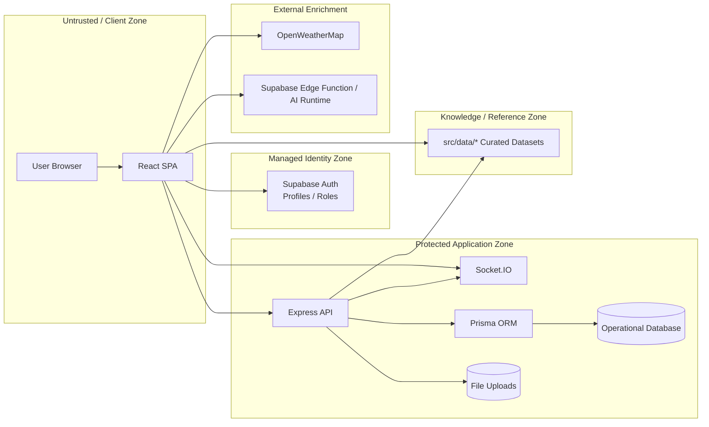
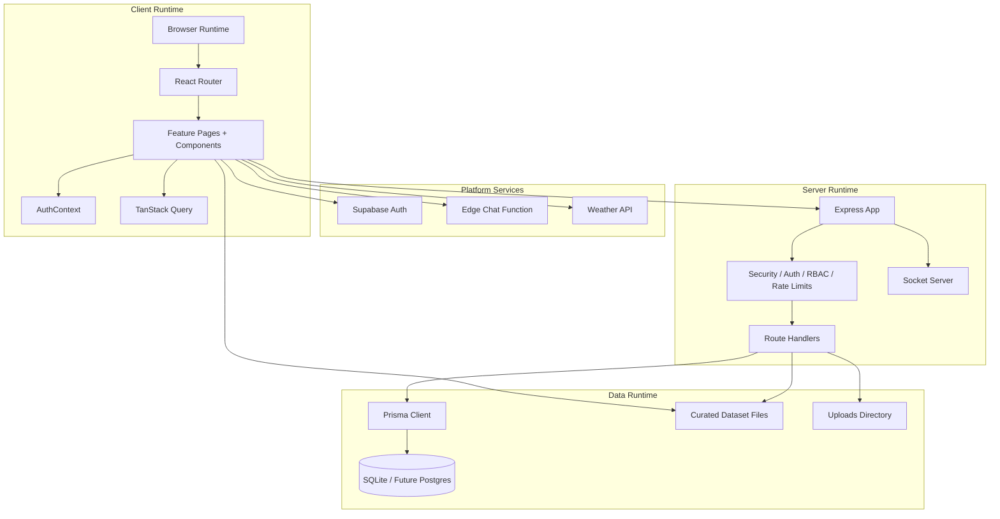
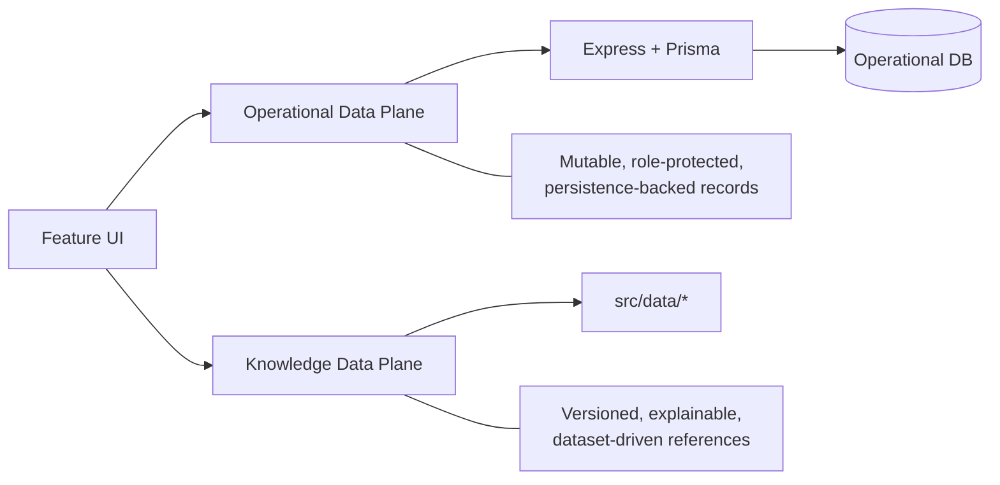
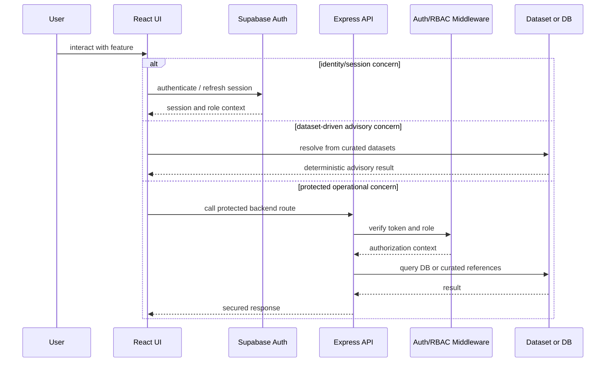
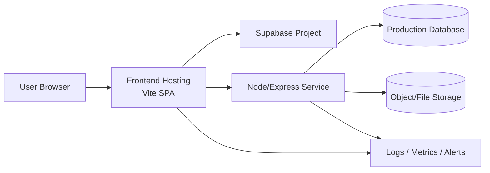
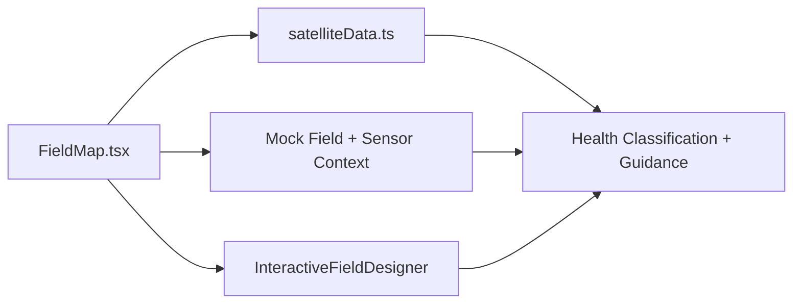
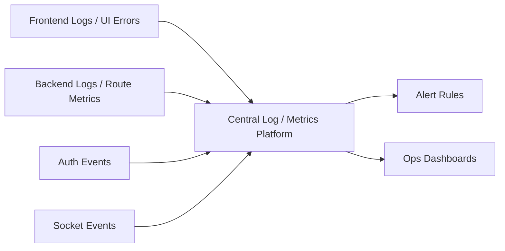
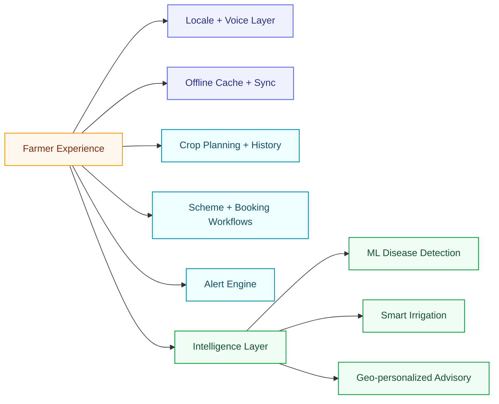

# System Design

## Executive summary

This document presents Farm Intellect in a more enterprise-style format than the core architecture overview. It describes the system as a set of cooperating runtime boundaries, trust zones, feature domains, and operational concerns rather than only as pages and folders.

Farm Intellect is best understood as a **hybrid digital agriculture platform** built from:

- a React frontend orchestration layer
- a Supabase identity boundary
- a custom Express application boundary
- a curated agricultural knowledge boundary
- selected external enrichment services

The design goal is not only feature completeness, but also explainability, role separation, and a migration path toward stronger production-grade service decomposition.

## Design goals

### Product goals

- unify farmer, expert, merchant, and admin workflows in one platform
- make agricultural intelligence explainable and demo-stable
- support both advisory and operational use cases

### Engineering goals

- keep user journeys modular by role
- isolate protected operations behind a backend trust boundary
- maintain deterministic dataset-backed features where useful
- preserve a clear path toward stronger contract validation and observability

### Enterprise-readiness goals

- explicit service ownership
- documented trust boundaries
- scalable deployment topology
- operational monitoring roadmap

## System context and trust zones



## Container / runtime view



## Hybrid data-plane model

Farm Intellect deliberately uses two complementary data planes.

### Operational data plane

Used for protected, mutable, application-owned records:

- users and profiles in the backend domain
- documents and verification states
- notifications
- forum and chat history
- activities and analytics records

### Knowledge data plane

Used for reference-grade, versioned agricultural knowledge:

- crop recommendations
- soil references
- crop disease reference data
- pest reference data
- crop calendar content
- market and production reference datasets
- satellite interpretation thresholds



## Request and control-flow model



## Deployment topology



## Feature-domain architecture

### AI advisory

#### Role in the product

AI advisory helps farmers and experts evaluate crop suitability, expected yield, and recommended next steps based on soil, seasonal, and agronomic inputs.

#### Primary implementation files

- `src/pages/AIAdvisory.tsx`
- `src/components/ai/CropRecommendationEngine.tsx`
- `src/components/analytics/YieldPredictor.tsx`
- `src/data/cropRecommendations.ts`
- `src/data/soilHealth.ts`
- `backend/src/routes/ai.js`

#### Current ownership model

- **Frontend** owns orchestration and user input flow
- **Curated datasets** provide the main recommendation intelligence today
- **Backend AI routes** exist as a protected expansion path for server-side recommendation workflows

```mermaid
flowchart LR
    UserInput[Farmer / Expert Inputs]
    AdvisoryPage[AIAdvisory.tsx]
    CropEngine[CropRecommendationEngine]
    YieldPredictor[YieldPredictor]
    CropData[cropRecommendations.ts]
    SoilData[soilHealth.ts]
    AiRoute[/api/ai/recommend-crops]
    Output[Recommendations + Yield Views]

    UserInput --> AdvisoryPage
    AdvisoryPage --> CropEngine
    AdvisoryPage --> YieldPredictor
    CropEngine --> CropData
    CropEngine --> SoilData
    CropEngine -. optional protected flow .-> AiRoute
    CropEngine --> Output
    YieldPredictor --> Output
```

#### Enterprise-style interpretation

- recommendation logic is currently dataset-first and highly explainable
- server-side recommendation APIs represent the future enforcement and personalization path
- this feature is a strong candidate for shared schema validation and model-serving separation later

### Crop scanner

#### Role in the product

The crop scanner converts image or symptom inputs into likely disease and pest diagnoses, then returns treatment and prevention guidance.

#### Primary implementation files

- `src/pages/AICropScanner.tsx`
- `src/components/features/AICropDiseaseScanner.tsx`
- `src/data/cropDiseases.ts`
- `src/data/pestData.ts`
- `src/lib/aiStream.ts`
- `backend/src/routes/ai.js`

#### Current ownership model

- **Frontend page flow** owns image selection, symptom capture, and UI state
- **Curated disease/pest datasets** provide explainable agricultural references
- **AI streaming runtime** supplements analysis generation
- **Backend upload route** is available for protected image-processing expansion

```mermaid
flowchart LR
    ImageInput[Image / Symptom Input]
    ScannerPage[AICropScanner.tsx]
    ScannerComp[AICropDiseaseScanner]
    DiseaseData[cropDiseases.ts]
    PestData[pestData.ts]
    AIStream[aiStream.ts / AI runtime]
    BackendUpload[/api/ai/* image route]
    Result[Diagnosis + Severity + Treatment]

    ImageInput --> ScannerPage --> ScannerComp
    ScannerComp --> DiseaseData
    ScannerComp --> PestData
    ScannerComp --> AIStream
    ScannerComp -. protected upload path .-> BackendUpload
    DiseaseData --> Result
    PestData --> Result
    AIStream --> Result
```

#### Enterprise-style interpretation

- this feature already has a natural future boundary for model inference services
- it should eventually separate image ingestion, inference, reference enrichment, and audit logging
- today its strength is explainable output grounded in domain datasets rather than black-box-only responses

### Analytics

#### Role in the product

Analytics surfaces user, crop, market, scanner, production, and yield signals for experts and administrators, while also supporting farmer-facing insight views.

#### Primary implementation files

- `src/pages/Analytics.tsx`
- `src/components/analytics/EnhancedAnalytics.tsx`
- `src/components/analytics/YieldPredictor.tsx`
- `src/data/cropProduction.ts`
- `src/data/mandiPrices.ts`
- `backend/src/routes/analytics.js`

#### Current ownership model

- **Frontend analytics UI** owns chart rendering and dashboard composition
- **Curated production/mandi datasets** provide the strongest current analytics content
- **Backend analytics routes** support role-aware protected analytics retrieval

```mermaid
flowchart LR
    AnalyticsPage[Analytics.tsx]
    Enhanced[EnhancedAnalytics]
    Yield[YieldPredictor]
    Production[cropProduction.ts]
    Mandi[mandiPrices.ts]
    AnalyticsAPI[/api/analytics/dashboard]
    Charts[KPIs / Trends / Comparisons]

    AnalyticsPage --> Enhanced
    AnalyticsPage --> Yield
    Enhanced --> Production
    Enhanced --> Mandi
    Enhanced -. protected data path .-> AnalyticsAPI
    Yield --> Charts
    Production --> Charts
    Mandi --> Charts
    AnalyticsAPI --> Charts
```

#### Enterprise-style interpretation

- analytics is currently a blend of reference intelligence and protected operational metrics
- the long-term target would separate operational BI, domain reference analytics, and reporting exports
- this feature is a strong candidate for warehouse/reporting infrastructure later

### Field map

#### Role in the product

Field map combines field-layout interaction, NDVI/NDWI-style vegetation interpretation, and sensor-style contextual panels to support monitoring and planning.

#### Primary implementation files

- `src/pages/FieldMap.tsx`
- `src/components/features/InteractiveFieldDesigner.tsx`
- `src/data/satelliteData.ts`

#### Current ownership model

- **Frontend** owns nearly all current interaction flow
- **Curated satellite datasets** provide vegetation thresholds and crop stage interpretation
- **Interactive canvas tooling** supports planning and demonstration workflows



#### Enterprise-style interpretation

- this feature is currently presentation-strong and data-model-light
- a future production version would integrate GIS layers, device telemetry, and satellite refresh jobs
- it is the clearest candidate for a dedicated geospatial service boundary if the product scales

### Chat

#### Role in the product

Chat provides conversational assistance and user-to-user or user-to-system message workflows across advisory, knowledge retrieval, and realtime communication.

#### Primary implementation files

- `src/pages/Chat.tsx`
- `src/components/chat/AIChatbot.tsx`
- `src/components/ai/SmartChatbot.tsx`
- `src/lib/aiStream.ts`
- `src/data/kisanCallCenter.ts`
- `src/data/cropDiseases.ts`
- `backend/src/routes/chat.js`
- `backend/src/server.js` Socket.IO setup

#### Current ownership model

- **AIChatbot** owns streaming assistant UX
- **SmartChatbot** owns dataset-grounded local knowledge retrieval
- **Backend chat routes and Socket.IO** own protected history and realtime operations
- **Supabase edge runtime** contributes AI response generation

```mermaid
flowchart LR
    ChatPage[Chat.tsx]
    AIChatbot[AIChatbot]
    SmartChatbot[SmartChatbot]
    AIStream[aiStream.ts]
    KCC[kisanCallCenter.ts]
    Disease[cropDiseases.ts]
    ChatAPI[/api/chat]
    Socket[Socket.IO]
    Responses[Assistant Replies + Realtime Messages]

    ChatPage --> AIChatbot
    ChatPage --> SmartChatbot
    AIChatbot --> AIStream
    SmartChatbot --> KCC
    SmartChatbot --> Disease
    AIChatbot -. protected history .-> ChatAPI
    AIChatbot -. realtime sync .-> Socket
    AIStream --> Responses
    KCC --> Responses
    Disease --> Responses
    ChatAPI --> Responses
    Socket --> Responses
```

#### Enterprise-style interpretation

- chat is already multi-boundary: dataset retrieval, AI streaming, protected backend history, and realtime channels
- it is the feature most likely to benefit from contract tests, token propagation tests, and chat moderation controls
- this is also the clearest candidate for message retention policy and abuse detection enforcement

## Cross-cutting operational concerns

### Security controls

- frontend protected routes
- Supabase-managed identity and session layer
- backend JWT verification and RBAC
- route-specific rate limiting for auth, chat, and AI
- protected Socket.IO handshake validation

### Reliability controls

- App-level error boundary on the frontend
- centralized backend error handling
- deterministic dataset fallbacks for advisory-heavy features

### Observability roadmap



## Recommended enterprise upgrades

- adopt shared API schemas for frontend and backend
- formalize model-serving and image-analysis boundaries for the crop scanner
- separate operational analytics from curated reference analytics
- introduce geospatial and telemetry boundaries for the field map
- add centralized observability, audit logging, and retention policies
- move from development-oriented persistence to production-grade database and object storage infrastructure

## Planned capability expansion

The next roadmap wave adds new system responsibilities beyond the current hybrid baseline.

### New capability families

- multilingual support expansion
- offline/PWA-first farmer mode
- image-based disease detection with ML model
- personalized crop planning
- field history timeline
- subsidy/scheme eligibility wizard
- smart irrigation advisory
- alert engine for pests/weather/market drops
- expert booking + consultation workflow
- village/mandi geo-personalization

### Future-state expansion view



### Architectural meaning

This next wave introduces:

- a stronger localization boundary
- offline-first synchronization responsibilities
- event-driven alerting and workflow orchestration
- persistent farm-history and planning records
- a model-serving boundary for image-based disease detection

The detailed breakdown is documented in [`future-capabilities.md`](./future-capabilities.md).